# GP FutureMakers Full Architecture

Configuration B with integrated mental wellbeing  
Architecture baseline 1.0 · 30 September 2026 · Synthetic adult web prototype

**Source review completed.** The complete architecture prompt, all text and tables in both Word documents, and the product review's embedded dependency diagram were inspected. The scope is **18 CORE + 27 ORIGINAL MVP + 5 ADDED MVP = 50 unique required features**. This is an architecture and implementation handoff, not an implemented, tested or clinically validated application.

The five additions are F183, F184, F185, F187 and F213. Their bounded variants come from the revised prompt; they were not approved in the older product review. Product decisions are distinguished below from engineering defaults and activation gates. All timings, limits and retention periods labelled **default** are proposed prototype settings, not clinical standards or competition rules.

## 1 Executive Architecture Summary

Build a **modular monolith with a separately running worker**. One TypeScript codebase owns the browser application, REST API, domain rules and background jobs. PostgreSQL holds structured records and jobs; private object storage holds source files. Provider adapters perform document extraction and batch speech transcription. Deterministic services own authorization, scoring, normalization rules, question selection, citations and clinical update commits.

The product reconstructs context from patient-held evidence. Its central loop is paper → source-linked claims → medication and lab context → disagreements and gaps → a few neutral patient questions → a doctor brief → a reviewed visit update. The differentiator is **Reconcile and Ask**. The brief makes that work usable; the wellbeing branch reuses the same provenance and review infrastructure.

Maintain two distinct layers of truth. The **evidence ledger** admits documented, patient-reported and caregiver-reported claims with explicit status. The **clinician-confirmed projection** changes only through an authorized doctor's review transaction. An extracted prescription can appear as an unverified documented claim without silently becoming the confirmed current medication plan.

Wellbeing is optional and private by default. A patient can contribute their own concern without completing an assessment. A fixed WHO-5 adapter calculates scores deterministically when its activation checks pass. Only patient-selected content reaches a specifically authorized doctor. Distress handling provides bounded human-help routes and truthful handoff status; it does not diagnose, monitor emergencies or alert third parties automatically.

**Build target:** one synthetic adult case, three medication/test issues, three neutral Bangla questions, a restricted wellbeing branch, a source-linked brief and one atomic doctor-confirmed update. Every required feature has a concrete owner in Section 25. Production expansion requires the gates in Section 27.

## 2 Source of Truth Interpretation and Explicit Mental Wellbeing Scope Changes

### 2.1 Authority and source manifest

| Source key | Supplied file | Architectural authority |
|---|---|---|
| P | GP_FutureMakers_Architecture_Prompt_With_Mental_Wellbeing.txt, revision 2 | Requested deliverables and explicit wellbeing override |
| R | Product concept review(1).docx, 30 September 2026 | Configuration B, original 45, exclusions, hero, review boundaries and demo |
| B | GP FutureMakers 2026 — Master Feature Bank(1).docx | Definitions and dependencies of all 257 candidates; not a mandate to build 257 |

Precedence: P's bounded wellbeing revision → R for remaining product decisions → B for feature meanings. Marketing statistics, competitor claims, legal summaries and deadlines in R are source context, not independently verified claims in this specification. No legal-compliance certification is implied.

### 2.2 Original and revised scope

| Scope | Original review | Required here | Exact limitation |
|---|---|---|---|
| Original CORE | 18 | 18 | Preserved |
| Original MVP | 27 | 27 | Preserved; security mechanics strengthened as required by P |
| F183 distress support | PITCH | ADDED MVP | Explicit disclosure support, optional authorized review task; no autonomous risk assessment |
| F184 assessment | Outside original 45 | ADDED MVP | WHO-5 adapter, fixed wording and deterministic scoring; PHQ-9 and GAD-7 deferred |
| F185 wellbeing history | LT | ADDED MVP | Voluntary self-report and sourced history; no inferred condition or causal explanation |
| F187 respectful presentation | LT | ADDED MVP | Patient-selected wording, private-topic preference and no forced retelling; no trauma classifier |
| F213 sensitive vault | Outside original 45 | ADDED MVP | Wellbeing data and its derivatives only; enforce through access policy |
| Total | 45 | 50 | 18 CORE and 32 MVP |

### 2.3 Decision register

| ID | Kind | Decision and consequence |
|---|---|---|
| D01 | Source decision | Configuration B remains the product; no separate mental-health chatbot |
| D02 | Prompt default | Adult synthetic demo; no pediatric, capacity or guardian-consent workflow |
| D03 | Prompt recommendation adopted | WHO-5 is the only assessment adapter in scope; activation and clinical readiness are independent |
| D04 | Engineering default | Modular monolith plus worker; no microservices, vector database, autonomous agents or hospital integration |
| D05 | Source correction | R says “two brand names, one molecule” but lists Seclo as omeprazole and Maxpro as esomeprazole. Preserve separate ingredient identities; demonstrate a potential same-class overlap, not exact equivalence. Verify products and strengths before using branded fixtures |
| D06 | Ambiguity resolution | R alternates between seven papers and eight documents. Freeze seven pre-visit papers plus two strips, followed by one new prescription: eight papers across the full loop |
| D07 | Prompt override | R allows F212/F217 thin stubs; P requires real authorization, consent and revocation. These controls must execute on synthetic data |
| D08 | Engineering default | Mixed or uncertain-sensitive source pages are withheld whole. Verified redacted crops are a later extension, not a required redaction product |
| D09 | Engineering default | Evidence is append-only within its retention period. Deletion can remove payloads and leave minimal tombstones; “immutable” does not mean perpetual retention |
| D10 | Dependency narrowing | Supporting mechanics such as basic identity, hash deduplication and consent audio do not promote full F174/F016/F234 products |
| D11 | Source inconsistency | R's source diagram includes optional F001/F009/F021. The 45-feature table governs scope; necessary limited upload/extraction validation is infrastructure, not full feature promotion |
| D12 | Engineering default | Generic QR exposes only an explicitly approved general brief. Restricted material always requires the named clinician's authenticated browser session |
| D13 | Engineering default | Assessment mode starts UNAVAILABLE until verified assets are installed; synthetic arithmetic tests work independently. DEMO_ONLY is permitted after content and rights checks, without implying real-patient readiness |
| D14 | Engineering default | Three main questions, maximum five automatically asked in one interview; voluntary wellbeing is separate. These are burden-control settings, not clinical coverage claims |
| D15 | Source boundary | Clinical update confirmation is per item, then one commit; any bulk approval control excludes uncertain handwritten fields |

### 2.4 Non goals and architectural guardrails

No diagnosis generation, prescribing, dose advice, treatment recommendations, autonomous triage, image diagnosis, emotion inference, psychotherapy, generic chatbot, ambient note product, telemedicine, pharmacy marketplace, reminders, gamification, wearable integration, population analytics, blockchain or full EMR. F186 stays excluded. No negative finding is inferred from missing data. No hidden medication or wellbeing entry may be disclosed under a safety pretext.

## 3 Users and Core User Journeys

### 3.1 Roles and authority

| Role | Read scope | Write scope | Approval authority | Boundary |
|---|---|---|---|---|
| Patient | Own case and private entries | Upload, narrative, answers, wellbeing, consent, grants | Confirms self-report, assessment options and sharing | Cannot mark clinical facts doctor-confirmed |
| Caregiver | Explicit general case contribution scope | Upload and attributed observations | Can confirm what they read on a paper, with contributor identity | No sensitive view, assessment impersonation or clinical override |
| Doctor | Named patient-specific grant, appropriate purpose and resources | Review annotations, corrections and visit decisions | Clinical confirmation on granted resources | A doctor role alone grants nothing; cannot rewrite patient experience |
| Worker | Job-specific resource IDs and permitted processing purpose | Candidate extraction, derived issues and proposals | None | No clinical approval or independent grant creation |
| Demo operator | Synthetic cases only | Reset/seed demo and start evaluations | None | No automatic clinical access to future real records |
| Evaluator | Labelled synthetic evaluation material | Ground-truth revisions and evaluation runs | Label adjudication only | Cannot convert benchmark labels into patient records |

### 3.2 Journeys and acceptance endpoints

**J1 prepare and reconcile.** Tanvir uploads to Rahima's explicitly selected case. The wrong-person paper enters quarantine; accepted records retain their original source. Rahima reviews her complaint and answers three focused questions. The medication board shows prescribed, seen-at-home and reported-taking claims separately. The outcome is clarified evidence, including unresolved issues for the doctor.

**J2 optional private wellbeing.** Tanvir ends his session. Rahima authenticates separately and enters the private step. She may skip, write a concern, or opt into the available assessment. She reviews wording, chooses Dr A and selected content, previews exactly what will be shared, then grants access. General healthcare intake continues even after decline, incomplete assessment or private-step exit.

**J3 doctor brief.** A general QR opens the approved general view. Dr A authenticates to see only the selected restricted block. Every clinical item has an evidence action, timestamp, origin label and “why shown”. Dr B without a grant sees no private block, counts or revealing placeholders.

**J4 close the visit.** New evidence produces a before/after proposal. The doctor reviews each item, corrects any uncertainty and commits against the current case version. New events are appended, historical claims remain accessible, and affected projections are invalidated. Patient-reported use is not retroactively overwritten by the new prescribed plan.

**J5 support interruption.** An explicit disclosure or the always-visible help action displays the approved support surface. Sharing is optional. The interface distinguishes an unmonitored service, a created request and actual clinician acknowledgement. Exiting or resuming intake does not mark a concern clinically resolved.

## 4 System Context

The system boundary includes the browser UI, API, policy checks, worker, relational ledger, object storage and curated registries. External dependencies are an authentication email provider only if later enabled, chosen AI providers, published instrument assets and reviewed terminology/support-resource sources. There is no runtime dependency on DGHS SHR, hospital APIs or DGDA availability.

| Boundary | Information crossing it | Required control |
|---|---|---|
| Browser to API | Inputs, selected case, consent and review decisions | Session, CSRF protection, case authorization and server validation |
| API to database | Scoped queries and transactional changes | Non-owner runtime role, row policies and explicit field selection |
| Worker to AI provider | Minimum authorized image, text or audio for one task | Processing consent, disclosure minimization, approved provider configuration |
| Storage to source viewer | Authorized bytes only | API proxy with fresh authorization; no public clinical bucket |
| Patient to doctor | Explicit general or restricted view | Grant, purpose, recipient, expiry and current privacy epoch |
| Export to paper/download | Authorized snapshot | Explicit export permission and irreversible-copy disclosure |

## 5 End to End Product Flow

### 5.1 Flow and durable checkpoints

1. Create/select case and establish contributor role. Show synthetic-data notice in demo mode.
2. Collect purpose-specific consent. Capture each document, text input or explicitly consented audio through its own adapter.
3. Validate uploads, record content hash, store private bytes, create a source artifact and enqueue processing atomically. Private owner-authorized processing may extract identity headers first; no clinician/caregiver view receives newly processed content before its sensitivity scope is settled.
4. Extract fields with source regions. Run identity, schema and sensitivity checks. Quarantined documents cannot create case facts.
5. Normalize accepted candidates against pinned terminology versions. Preserve source values. Unknown matches remain unresolved.
6. Build versioned candidate context from admitted claims; build confirmed projections separately. Detect conflicts and gaps using the authorized subset.
7. Select neutral questions, capture answers and preserve attribution. Recompute issues; stop after the question budget or patient exit.
8. Offer the separate private wellbeing branch. Review and sharing are independent of healthcare completion.
9. Compose the doctor's authorized structured brief. Verify citations before optional wording generation and again before delivery.
10. Process new visit evidence into a change proposal. Doctor reviews, then commits accepted items in one transaction.
11. Append audit records and job events; invalidate derived views and regenerate when authorized. Delete temporary audio according to retention policy.

### 5.2 One medication fact through the entire system

The following identifiers describe a synthetic fixture, not a real prescription or recommendation.

| Stage | Object and action | What stays true |
|---|---|---|
| Paper | `src_rx_a`, page 1 contains source text “amlodipine 5 mg” | Original image immutable within retention |
| Extraction | `run_01` emits candidate with `anchor_rx_a_5mg` | OCR text and bounding box retained |
| Normalization | `fact_med_01/rev_1` maps ingredient and strength via dictionary version | Mapping does not invent frequency or start date |
| Claim | MedicationClaim evidence kind PRESCRIBED | Not proof the medicine was taken |
| Strip | `src_strip_b` produces SEEN_AT_HOME claim “amlodipine 10 mg” | Possession is not dispensing verification or adherence |
| Reconciliation | `issue_strength_01` cites both claim revisions | Strength mismatch candidate, no dose recommendation |
| Ask | `q_strength_01`: “আপনি এখন কোন স্ট্রিপ থেকে ওষুধটি খান?” | Neutral wording and “জানি না”/skip options |
| Answer | `input_answer_01`: patient reports using the pictured strip | New PATIENT_REPORTED claim; not doctor confirmation |
| Brief | `briefitem_04` shows prescribed 5 mg versus reported 10 mg | Doctor-only discrepancy display with both sources |
| Evidence jump | Policy resolves anchors to highlighted page/strip | No storage URL or neighboring sensitive page bypass |
| New visit | `src_rx_today` explicitly documents the doctor's stated plan | AI extracts, does not originate treatment |
| Proposal | `update_01/item_02` cites new evidence and prior snapshot | Before/after values and uncertainties visible |
| Confirmation | `review_02` identifies doctor, item revision and decision | No stale or unauthorized approval |
| Commit | New MedicationEvent and context version; old events retained | Confirmed prescribed plan changes; reported behavior remains a separate claim |

## 6 Frontend Architecture

### 6.1 Page map

Use a mobile-friendly patient shell and a desktop-friendly doctor shell. Evidence viewing, answers, consent and corrections are drawers/panels within the relevant route, not separate disconnected applications. Screen IDs below are used in traceability.

| ID and route | Users and purpose | Main components and actions | Data and API groups |
|---|---|---|---|
| U0 `/` and `/demo` | Everyone; explain/start labelled demo | Synthetic notice, scenario picker, runtime badges, sign-in | auth, demo |
| U1 `/cases` and `/cases/:c` | Patient/caregiver; case selection | Identity header, contribution scope, case overview, consent entry | patients, cases, consents |
| U2 `/cases/:c/evidence` | Patient/caregiver and authorized doctor | Single-file upload, processing tray, quarantine, field review, source drawer | documents, inputs, jobs, facts, evidence |
| U3 `/cases/:c/context` | Patient and authorized doctor; caregiver gets granted subset | Timeline, medication board, lab charts, allergies, orders tabs | timeline, medications, labs, allergies, test-orders |
| U4 `/cases/:c/prepare` | Patient/caregiver within scope | Complaint, agenda, issue inbox, question card, evidence request, answer review | narratives, conflicts, gaps, interviews, answers |
| U5 `/cases/:c/wellbeing` | Patient private session | Optional check-in, assessment, original-wording review, topic controls | wellbeing, instruments, assessments, consents |
| U6 `/cases/:c/sharing` | Patient | Exact preview, named recipient, expiry, scope selection, revoke | sharing-grants, shares, briefs, consents |
| U7 `/doctor/cases/:c/brief` | Authorized doctor | One-screen brief, banner, flags, wellbeing block if granted, evidence drawer | briefs, evidence, reviews |
| U8 `/share` and `/briefs/:b/print` | Bearer general viewer or authorized exporting user | Expiry status, general brief, generation date, PDF/print warning | shares/redeem, shared-brief, briefs/export |
| U9 `/doctor/cases/:c/visits/:v` | Doctor; patient upload subview | New evidence, replayed record check, change preview, item decisions, commit | visits, documents, updates, reviews |
| U10 `/cases/:c/history` | Patient and scoped doctor | Changes, original/corrected versions, minimal access/action history | audit, facts/revisions, visits |
| U11 `/evaluation` | Demo operator/evaluator | Dataset manifest, measured denominators, failures, run comparison | evaluation |
| U12 `/help` plus interruption panel | Everyone, including logged-out users | Static supportive content, verified local routes if present, no-monitoring label, exit | support-resources; optional support-events |

### 6.2 State contract for every surface

The following overrides are applied in addition to shared states. Initial loading never renders old sensitive data. API errors preserve unsent non-sensitive values in memory only; private values are concealed on session loss. Trust badges show origin, review and processing status separately.

| Screen | Empty | Loading | Low confidence or ambiguity | Review | Success | Error and recovery |
|---|---|---|---|---|---|---|
| U0 | No scenario available | Loading seeded manifest | Unavailable component badge | None | Scenario ready | Retry; prerecorded backup explicitly labelled |
| U1 | Create/select case | Fetch permissions | Identity incomplete | Confirm selected patient | Scoped case opened | Denied returns neutral not-found screen |
| U2 | Add one file | Per-stage progress, not invented percentage | Candidate alternatives and unreadable fields | Crop beside editable proposed value | Evidence admitted with origin label | Partial output retained; retry failed stage/retake |
| U3 | No admitted claims | Load authorized projections | Parallel contradictory claims; unjoined lab points | Link to relevant review task | Version/freshness visible | “Context unavailable”; never empty implies no medicines |
| U4 | Capture complaint | Planning questions | Clarify original words; unknown available | Review answers before save | Questions complete or skipped; unresolved issues remain | Typed/template fallback; help always accessible |
| U5 | Not asked/opt-in invitation | No previous private content in skeleton | Transcript confirmation; no imputed score | Patient confirms words/options | Saved privately; COMPLETE distinct from SHARED | Unavailable instrument leaves self-report usable |
| U6 | No grants | Build exact recipient preview | Unreviewed source excludes affected item | Patient confirms content and expiry | Grant active/revoked | Stale preview must refresh; no silent broader grant |
| U7 | No authorized brief | Fetch scoped version | Unverified/conflicting labels | Doctor inspects evidence | Brief ready with source actions | Revoked view blanks content; never expose withheld count |
| U8 | Link unavailable | Redeem token once | Incomplete-context notice | Export scope confirmation | Authorized general view/PDF | Expired/revoked link; request new sharing action |
| U9 | Add visit evidence | Extract and diff | Handwritten/high-value uncertainty blocks affected acceptance | Per-item accept/correct/reject | Atomic commit receipt | Version conflict reloads diff; no partial commit |
| U10 | No visible events | Paginated history | Original claim status retained | Correction reasons visible if permitted | Version trail loaded | Unavailable log does not imply no past activity |
| U11 | Not run | Running actual evaluation | Low denominators and untested slices labelled | Adjudication differences | Measured results only | Failed run never replaced with fabricated numbers |
| U12 | Generic help routes | Static text renders immediately | Ambiguous text gets bounded clarification/support | Explicit sharing preview if requested | Resources displayed; actual task states separate | Offline/API failure uses bundled reviewed text; no delivery claim |

### 6.3 Interaction and localization defaults

Use Bangla primary patient labels with an English toggle; doctor labels can remain English with original Bangla excerpts. Preserve `bn`, `en` and `bn-Latn` separately. Dates display in Asia/Dhaka; database timestamps are UTC. Unknown dates show precision, not a fabricated day. Large touch controls, keyboard navigation, text plus icon status and visible focus are basic implementation quality, not promotion of whole accessibility feature products.

The brief order is complaint/agenda, sourced critical banner, up to three highest-priority issues, prescribed/reported medication comparison, relevant labs and tests, selected wellbeing block, blind spots and source/freshness footer. A “more context” control exposes the remaining authorized items. The one-minute target is a usability hypothesis to test, not guaranteed reading time.

## 7 Backend and Domain Architecture

### 7.1 Modules

All modules use typed commands/queries and repository interfaces. Route handlers only authenticate, validate and dispatch. A module cannot bypass ACCESS by importing another module's raw tables. TRUST supplies audit/evidence utilities; no module receives unrestricted clinical database credentials.

| Module | Responsibility and inputs → outputs | Storage and dependencies | Execution | Failure behavior |
|---|---|---|---|---|
| ACCESS | Actor, resource, purpose and consent → allow/deny plus scope fingerprint | User, Consent, Grant, ShareLink, Resource; used by all | Sync at every boundary | Fail closed; conceal resource existence |
| CASE | Patient/profile/contributor/encounter commands → scoped case | Patient, Case, CaregiverRelationship, Encounter, Provider; ACCESS | Sync | Reject cross-patient linkage and unknown contributor |
| INGEST | File/text/audio → source anchors, candidate facts and review tasks | SourceArtifact, DocumentPage, EvidenceAnchor, ProcessingRun; adapters, ACCESS, TRUST | Upload sync; processing async | Quarantine, partial extraction, typed fallback |
| TERMINOLOGY | Raw terms and dates → dictionary candidates/normalized values | Concept, DrugProduct, LabDefinition, alias assets; TRUST | Lookup sync, assisted candidate extraction async | UNKNOWN with original value; never guessed match |
| CONTEXT | Admitted claims and accepted events → scoped timeline/medication/lab views | Fact, FactRevision, medication/lab/order subtypes and ContextSnapshot | Sync small queries; async rebuilding | Mark stale/unavailable; never silently overwrite truth |
| RECONCILE | Scoped claims and gaps → Issue records and evidence requests | Issue, EvidenceEdge; CONTEXT, TERMINOLOGY, ACCESS | Async after change; sync on small seeded case | Preserve previous version labelled stale; no false “all clear” |
| INTERVIEW | Eligible issues and budget → neutral questions; answers → new claims | Interview, Question, SourceArtifact, FactRevision; RECONCILE, WELLBEING support gate | Sync templates; optional async language aid | Use curated templates; stop on guardrail/patient exit |
| WELLBEING | Opt-in, self-report and fixed responses → private context, scores and support states | WellbeingEntry, InstrumentDefinition, Assessment tables, SupportEvent/Resource; ACCESS, TRUST | Sync scoring/policy; async optional structuring | No score on invalid/incomplete input; static support fallback |
| BRIEF | Authorized structured context → cited Brief/BriefItem and export | Brief, BriefItem, EvidenceEdge, artifacts; ACCESS, CONTEXT, TRUST | Async composition/PDF; sync fetch | Deterministic wording fallback; suppress unsourced item |
| VISIT | New evidence and base context → proposed diff → doctor-approved commit | VisitUpdate, UpdateItem, ReviewTask, ReviewAction, MedicationEvent; CONTEXT, TRUST | Async diff; sync transaction | Reject stale/unauthorized commit; retain proposal |
| TRUST | Evidence, stage confidence, corrections and actions → lineage/abstention/audit | EvidenceEdge, AuditEvent, ReviewAction; cross-cutting | Sync writes in owning transactions | Block commits if required audit fails; deny restricted reads if access audit cannot persist |
| EVALUATION | Versioned labelled fixtures and run config → measured metrics | EvaluationSet, EvaluationCase, EvaluationRun, EvaluationMetric | Async | NOT_RUN/FAILED with actual denominators; no patient-data auto-export |

JOBS and STORAGE are infrastructure adapters, not product capabilities. JOBS owns leases, retries and progress; STORAGE owns private byte transfer, hashing and deletion. Provider SDKs appear only behind AI adapters.

### 7.2 Internal event contracts

Persist outbox events in the same transaction as domain changes: `EvidenceAdmitted`, `InputConfirmed`, `ContextVersionChanged`, `IssueSetChanged`, `GrantRevoked`, `SensitivityChanged`, `VisitCommitted`, `AudioDeletionDue`, `EvaluationRequested`. Envelope: `{eventId, type, caseId, aggregateId, aggregateVersion, resourceIds, privacyEpoch, occurredAt, schemaVersion}`. Payloads contain IDs and operational metadata, not medical text. Consumers deduplicate by event ID. Source-to-derived invalidation is a correctness mechanic, not a general F205 learning feature.

## 8 AI and ML Architecture

### 8.1 Explicit task boundaries

| Task | Method | Input → output | Rationale and boundary |
|---|---|---|---|
| Document type/layout | VLM plus file metadata | One authorized page → type and layout candidates | Varied paper layouts; uploader-selected type can override after review |
| Printed Rx/lab extraction | VLM/OCR plus schema validation | Image/text spans → fields, rows, anchors | Reading is probabilistic; no clinical interpretation |
| Narrow handwriting | VLM candidate readings | Crop → at most three candidates or unreadable | Human confirmation mandatory before usable drug identity |
| Strip reading | Packaging text extraction | Legible labelled strip → product/strength evidence | No loose-pill ID, authenticity or adherence claim |
| Terminology | Curated dictionary, exact/fuzzy candidates | Raw term → mapped concept/candidates | LLM may propose search strings, never create authoritative drug identity |
| Dosage notation | Parser with preserved tokens | “1+0+1” → three documented positions | Do not turn unknown tablet units into milligrams or add dosing advice |
| Lab conversion | Versioned exact conversion table | Known analyte/value/unit → normalized value | No inferred units or broad cross-method equivalence |
| Supersession/time | Explicit language rules; optional candidate extraction | New/old claims → proposed relation | Recency alone never stops a medicine |
| Medication state/conflicts | Rules over versioned claims | Evidence kinds → candidate state/issues | Clinical significance and resolution remain doctor-reviewed |
| Question selection | Deterministic greedy coverage and templates | Issues/answers → bounded ordered questions | Reproducible minimum-burden behavior |
| Bangla/Banglish | Reviewed idiom lexicon, optional LLM structuring | Original text → candidates and clarifier | Preserve ambiguity such as “gas”; never infer disease |
| Speech | Batch speech adapter | Consented clip → transcript/segments | No streaming or emotion analysis; confirm uncertain terms |
| Brief | Structured ranking; optional bounded wording | Authorized facts → short cited items | Default renderer works without an LLM |
| Citation validation | IDs, value checks, source reachability | Candidate item → valid/abstain | No second LLM as sole factuality gate |
| Visit diff | Deterministic comparison plus extracted explicit statements | Old projection/new claims → update items | AI cannot supply a missing treatment instruction |
| Wellbeing structure | Optional constrained extraction | Consented own words → editable fields | Patient confirms wording; no inferred diagnosis or stress cause |
| Assessment scoring | Integer arithmetic in server domain module | Fixed five confirmed values → totals | Never sent to an LLM to calculate |
| Support routing | Versioned reviewed rules, optional semantic candidate only | Explicit words → workflow observation type | No global risk score; no negative safety clearance |
| Sensitive access | Deterministic policy | Actor/grant/lineage → allow/deny | Never delegated to a model |

### 8.2 Provider interfaces and contracts

Every provider result is untrusted. Validate strict schemas, maximum lengths, enums, case IDs, source IDs and coordinate bounds. A response cannot create a grant, review decision, score or committed fact. Embedded instructions in documents and transcripts are data, never tool instructions. Model calls have no browsing, arbitrary tools, database credentials or outbound recipient actions.

```typescript
type ID = string;
type Confidence = {
  stage: "OCR" | "ASR" | "ENTITY_LINK" | "GROUNDING";
  value: number | null; method: string; calibratedOn: string | null;
  reviewReason: string | null;
};
type ProviderContext = {
  taskId: ID; purpose: string; allowedResourceIds: ID[];
  privacyEpoch: number; policyFingerprint: string; schemaVersion: string;
};
interface DocumentExtractionResult {
  sourceId: ID; runId: ID; documentType: string;
  fields: {fieldKey: string; rawText: string | null; value: unknown;
    anchorIds: ID[]; confidence: Confidence[];
    candidates: unknown[]; state: "EXTRACTED" | "UNREADABLE" | "NEEDS_REVIEW"}[];
  blindSpots: {code: string; page: number; fieldKey?: string}[];
}
interface SpeechTranscriptResult {
  audioId: ID; language: "bn" | "en" | "bn-Latn" | "mixed";
  segments: {startMs: number; endMs: number; text: string;
    confidence: Confidence | null; speaker: "DECLARED_PATIENT" | "UNKNOWN"}[];
  confirmationRequired: true;
}
interface NormalizedEntityResult {
  raw: string; dictionaryVersion: string;
  selectedConceptId: ID | null;
  candidates: {conceptId: ID; matchMethod: string}[];
  status: "EXACT" | "HUMAN_SELECTED" | "AMBIGUOUS" | "UNKNOWN";
}
interface ConflictCandidate {
  type: string; claimRevisionIds: ID[]; ruleId: string;
  temporalOverlap: "EXPLICIT" | "POSSIBLE" | "NONE";
  priority: "REVIEW_FIRST" | "REVIEW_NEXT" | "INFORMATION";
  uncertaintyCodes: string[]; doctorOnly: boolean;
}
interface PatientQuestion {
  id: ID; targetIssueIds: ID[]; templateId: string; language: string;
  text: string; responseType: "SINGLE" | "MULTI" | "TEXT" | "PHOTO";
  options: {id: string; label: string}[];
  allowsUnknown: true; allowsSkip: true; stopConditions: string[];
}
interface BriefItem {
  id: ID; kind: string; displayText: string; factRevisionIds: ID[];
  evidenceAnchorIds: ID[]; whyCode: string; sourceStatus: string;
  reviewStatus: string; sensitivity: string; audienceFingerprint: string;
}
interface UpdateProposal {
  id: ID; caseId: ID; encounterId: ID; baseContextVersion: number;
  privacyEpoch: number; items: {id: ID; revision: number; operation: string;
    before: unknown; after: unknown; evidenceIds: ID[]; requiresReview: true}[];
}
interface WellbeingContextItem {
  id: ID; respondentId: ID; respondentRole: "PATIENT" | "CAREGIVER" | "DOCTOR";
  originalInputId: ID; originalWording: string; confirmedSummary: string | null;
  eventDate: string | null; datePrecision: string; requestDiscussion: boolean;
  sensitivity: "RESTRICTED_WELLBEING"; revision: number;
}
```

Assessment, access and support contracts are in Sections 11 and 17. A `null` confidence means unavailable, not zero accuracy. Vendor confidence and heuristic match quality are not displayed as calibrated clinical probability. Do not average OCR, ASR, entity and rule confidence into one “truth percentage”.

### 8.3 Provider configuration and fallback

Default to one Gemini adapter with separate document, text and batch-audio operations; a `gemini-3.8-flash` candidate is documented in the current structured-output examples. Pin the tested model ID and SDK version in the implementation manifest; validate image/audio capabilities and access using fixtures before locking the demo. This is a cost/complexity choice, not a claim of superior Bangla clinical accuracy. Google documents structured output and audio understanding [T4, T5].

Independent interfaces permit later OCR specialists, another text provider or Whisper-based transcription. Do not install a second provider solely for architectural symmetry. If an adapter is unavailable, use typed input, deterministic templates and previously processed artifacts visibly marked PREPROCESSED BUT REAL. Failure of live extraction must show a failed job; a fixture cannot silently replace its result.

Bound each request to one document page or short confirmed text. Default: 60 seconds per model call, two transient retries, one schema-repair attempt using the same authorized subset, and a per-case token/cost ceiling. Recheck consent before a provider call and before persisting its result. Do not submit private self-report to AI when model-processing consent is declined; structured fields and fixed controls remain functional.

## 9 Reconcile and Ask Engine

### 9.1 Medication identity and state

Identity dimensions are independent: product/brand ID, ingredient set, normalized strength including unit, dosage form, route if documented, and therapeutic class. Exact ingredient equality is not class overlap. A multi-ingredient product preserves every ingredient/strength. Unknown products never match solely because strings look similar.

Maintain evidence kinds `PRESCRIBED`, `SEEN_AT_HOME`, `PATIENT_REPORTED_USE`, `CAREGIVER_REPORTED_USE`, `DOCTOR_CONFIRMED_PLAN` and `DOCUMENTED_DISPENSED` only when explicit dispensing evidence exists. Clinical lifecycle is separately `STARTED`, `CONTINUED`, `CHANGED`, `PAUSED`, `STOPPED`, `UNKNOWN`. Review and supersession statuses are separate dimensions. Thus a claim can be documented, currently conflicting and unreviewed at once.

Omission from a later prescription creates UNCLEAR_CONTINUATION, not STOPPED. An explicit stop instruction creates a proposed event; only doctor review updates the confirmed plan. Patient reports of stopping create a reported-use event and a neutral reason question if appropriate. An unknown interval stays open-ended/uncertain, not indefinitely active with certainty.

### 9.2 Rule catalog

| Rule | Inputs and condition | Result | Question and resolution boundary |
|---|---|---|---|
| RX01 exact ingredient overlap | Distinct compatible product claims; same ingredient and explicit/possible overlapping use | EXACT_INGREDIENT_OVERLAP candidate | Ask which is currently used; clinician judges intentionality |
| RX02 class overlap | Distinct ingredients with curated same-class relation and possible concurrent use | CLASS_OVERLAP candidate, never “same molecule” | Group into one current-use question; doctor confirms significance |
| RX03 strength mismatch | Same ingredient/form with unequal normalized strength, Rx versus strip/use claim | STRENGTH_MISMATCH | Ask which strip is used; never advise a strength |
| RX04 off-record use | Patient reports product with no matched documented Rx in authorized evidence | OFF_RECORD_MEDICATION | Request name/strip if useful; label coverage limitation |
| RX05 unclear continuation | Older Rx and later omission without an explicit stop | UNCLEAR_CONTINUATION | “এখনও খান, বন্ধ করেছেন, নাকি নিশ্চিত নন?”; stop reason only after reported stop |
| RX06 explicit source disagreement | Contradictory same-field claims, without supersession resolution | SOURCE_DISAGREEMENT | Preserve both; request missing evidence or doctor review |
| LAB01 advised test unmatched | Sourced order, no appropriate later matched result | RESULT_NOT_AVAILABLE | Ask done/not done/unknown; “done, report at home” remains no result available |
| ID01 identity mismatch | Strong mismatched identity fields or uncertain subject | WRONG_PATIENT_REVIEW | Quarantine before context; patient identity review, no clinical anomaly-based reassignment |
| TERM01 unknown identity | Unmapped medication/test or unconfirmed handwriting | IDENTITY_UNRESOLVED | Ask for clearer evidence; suppress downstream confident equivalence |

No drug interactions, allergy cross-reactivity, test recommendations or lab panic thresholds are introduced. F081/F119 surface sourced allergy/reaction history; they do not implement F080. F190 is a **review-priority rule table**, not an automated patient risk grade. Strength disagreement and curated overlap candidates precede spelling issues; all priorities include rule ID and reasons and remain visible in the full list.

### 9.3 Ten-stage pipeline

1. Load permitted, admitted claim revisions and dictionary versions for the actor/purpose; quarantine excluded.
2. Group candidates by ingredient, product and test identity without merging evidence records.
3. Gather source/date/attribution links and classify issue type using the rule catalog.
4. Evaluate identity and interval rules; mark unknowns explicitly.
5. Rank using configured ordinal priority, complaint relevance and evidence uncertainty. Deduplicate the same issue signature, not the underlying claims.
6. Determine whether the patient can answer, has already answered or declined, and whether the answer would change a displayed uncertainty.
7. Select grouped questions to cover several eligible issues within budget.
8. Render reviewed templates and validate neutral wording, allowed concepts, consent and disclosure scope.
9. Patient confirms answer; create a new attributed claim/source and link to the question. Never overwrite the old document.
10. Re-evaluate affected rules. Mark `CLARIFIED_BY_REPORT`, `AWAITING_EVIDENCE`, `NEEDS_DOCTOR_REVIEW`, `DISMISSED_BY_DOCTOR` or `RESOLVED_BY_DOCTOR` as appropriate. A patient answer alone cannot clinically clear duplicate therapy.

### 9.4 Question planner contract

Eligible questions must have a current target issue, allowed audience, useful unanswered field and a reviewed template. Sort candidate templates by `newly covered priority points / estimated burden units`; use default review-priority weights 3, 2, 1 and burden 1 for choice, 2 for short text, 3 for new photo. Tie-break by fewer questions, then stable issue ID. These are software scheduling weights, not clinical severity probabilities.

```text
load authorized unresolved issues at context version V
discard questions already answered, declined, inaccessible or no longer relevant
while budget remains:
  select template covering the most remaining weighted uncertainty per burden
  group only compatible medicine-choice questions
  validate neutral wording and current permissions
  ask; accept answer, unknown, skip or exit
  if support guardrail fires: pause routine questions and show support route
  persist confirmed answer as attributed evidence; recompute affected issues
  stop when no useful question remains, patient exits or budget is reached
carry unresolved issues to doctor with no claim of complete reconciliation
```

Default main-demo questions: current use of the two acid medicines; which amlodipine strip is used; whether the advised HbA1c result is available. Unknown answers create an evidence request, not repeated interrogation. A skipped question stays suppressed for this encounter unless the patient explicitly reopens it. Fixed WHO-5 items never pass through this planner.

## 10 Integrated Mental Wellbeing Architecture

The branch joins the main loop in three places: private self-report enters the evidence ledger; consented context enters the authorized brief; clinician-authored review enters the visit history. It does not modify medication decisions or explain physical symptoms.

### 10.1 Independent workflow dimensions

| Dimension | States | Meaning |
|---|---|---|
| Participation | NOT_ASKED, OFFERED, OPTED_IN, DECLINED, EXITED | No state means illness/absence of illness |
| Entry | DRAFT, PATIENT_CONFIRMED, WITHDRAWN, SUPERSEDED | Original wording and prior confirmed revision retained until deletion |
| Assessment | NOT_STARTED, IN_PROGRESS, INCOMPLETE, SUBMITTED, SCORED, VOID, UNAVAILABLE | Completion and score availability only |
| Sharing | PRIVATE, PREVIEWED, GRANTED, REVOKED, EXPIRED | Consent to a recipient/scope; not implied by completion |
| Clinical review | NOT_REQUESTED, REQUESTED, SEEN, ACKNOWLEDGED, ANNOTATED | Actual human actions only |
| Support | Described in Section 11 | Separate from clinical review and assessment totals |

### 10.2 Collection and presentation

Collect a short own-words concern, optional onset/date precision, mood/stress/sleep/daily-life topic chosen by the patient, and “I want to discuss this with the doctor”. The patient may instead select “I want a private conversation” without a narrative. Do not ask why privacy is needed. Do not extract a trauma label, psychiatric diagnosis or medication indication from these fields.

Store caregiver observations as separately attributed evidence with restricted default sensitivity if about wellbeing. They never populate a patient's self-report instrument. The patient can review such an observation without being required to endorse it. A doctor's note is a new authored source with its own sharing scope; acknowledgement cannot rewrite the patient's answers.

An authorized doctor block contains date, selected concern, onset, discussion request, assessment identifier/version/score if available, source labels, review state and authorized source links. It may show one prior comparable score only when both assessments use an approved comparable instrument/scoring version. No trend arrow says recovery, deterioration, diagnosis or causation.

### 10.3 Private device handover

End the caregiver session before patient authentication; do not merely toggle a role selector. For synthetic demo accounts, use separate sessions with role-bound credentials. A presentation actor picker may open isolated browser sessions, but the server still enforces each identity. Reauthenticate to enter U5/U6; default concealment after two minutes of inactivity or immediately on explicit private exit. Page visibility loss conceals content; refocus requires a fresh authorization check. Clear component state, query caches and back-navigation snapshots. Sensitive drafts never enter localStorage, analytics, push notifications or service-worker caches.

This reduces accidental shared-device exposure; it cannot protect content already observed or photographed. A person who cannot access a private session can skip wellbeing and continue healthcare without penalty.

## 11 Assessment Contracts and Distress Support Workflow

### 11.1 Instrument activation

WHO's official publication describes five self-report items over the previous two weeks, with six response values. Its official scoring is a raw total from 0 to 25 multiplied by four for a 0–100 score [R1, R2]. The official publication links a Bangla version and states a noncommercial share-alike licence [R1]. Those facts do not validate this application's administration or intended population.

Official English and Bangla files were located during architecture review. **No questionnaire asset, text checksum or clinical approval is claimed to have been installed or completed here.** Implementation must download the official files, visually compare the Bangla item/option transcription, compute file and content SHA-256 values, record the correct rights/attribution, and obtain a reviewer sign-off. The instrument remains UNAVAILABLE until these content, scorer and usage gates pass. DEMO_ONLY permits labelled synthetic use after those checks; REAL_USE_APPROVED additionally requires clinical, language, operational and deployment review. The application must not reproduce questionnaire wording from model memory.

### 11.2 Fixed assessment contract

```typescript
interface AssessmentSubmission {
  sessionId: ID; expectedRevision: number;
  instrumentId: "WHO5"; definitionVersion: string; language: "bn" | "en";
  definitionChecksum: string; respondentId: ID;
  administrationMode: "FIXED_TEXT" | "CONFIRMED_TRANSCRIPTION";
  responses: {itemId: string; value: number; confirmed: boolean;
    sourceInputId?: ID}[];
}
interface AssessmentScore {
  assessmentRevisionId: ID; scoringVersion: string;
  definitionChecksum: string; responseHash: string;
  rawTotal: number; transformedScore: number; scoredAt: string;
  interpretation: null; diagnosticLabel: null;
  runtimeMode: "DEMO_ONLY" | "REAL_USE_APPROVED";
}
interface DistressSupportEvent {
  id: ID; evidenceResourceId: ID | null; protocolVersion: string;
  observation: "HELP_REQUEST" | "CURRENT_EXPLICIT" | "AMBIGUOUS"
    | "HISTORICAL" | "QUOTED_THIRD_PERSON" | "NEGATED" | "UNRECOGNIZED";
  presentationState: string; handoffState: string;
  displayedAt: string | null; recipientId: ID | null;
  grantId: ID | null; monitoringAvailable: boolean;
}
```

Require exactly five unique instrument item IDs, integer values 0–5 and five confirmed responses. `0` is a legitimate answer and must never mean missing. Reject unknown/duplicate items, fractions, strings-as-numbers, wrong language, mismatched checksum/version and a respondent other than the authenticated patient. A caregiver may not submit even with an upload grant.

The server recomputes `sum(values)` and `4 * sum(values)`; ignore client-supplied totals. Missing answers return `422 ASSESSMENT_INCOMPLETE` and no score. Draft saves allow missing answers, using explicit `UNANSWERED`, `SKIPPED` or `UNKNOWN` dispositions. A completed submission cannot silently reuse a prior session's answers. Definition changes never mutate an existing session; retire the old version or start a new session according to registry policy.

Use `If-Match`/expectedRevision for edits. A duplicate submit with the same idempotency key and request hash returns the original response; reuse with a different hash returns 409. Correction creates a new immutable assessment revision and new score, supersedes the previous score for current display, invalidates its briefs and retains historical dates. Do not silently migrate language mid-session. Stale revisions return 409 with the latest non-sensitive revision identifier.

The patient sees instrument, date and numeric score with a brief non-diagnostic explanation. No score threshold triggers support escalation or creates a “safe/unsafe” badge. Arithmetic is distinct from clinical interpretation. Future instruments with self-harm items require separately reviewed item-level support rules before activation.

### 11.3 Support protocol and handoff

A protocol registry stores a versioned Bangla/English response template, allowed observation categories, presentation rules, reviewer and activation status. In the prototype, only synthetic scenarios are activated unless reviewed deployment assets exist. Recognition uses the actual typed words or confirmed transcript, never tone, face, medication or score. Unconfirmed speech can display a generic help/clarification surface without persisting an asserted disclosure.

| Observed input class | Software behavior | What it must not claim |
|---|---|---|
| Ordinary low wellbeing | Continue voluntary collection; always-visible help remains | No disorder or crisis classification |
| Ambiguous distress wording | Offer bounded reviewed clarification and help; permit exit | No reassurance based on uncertain transcription |
| Explicit current concern | Pause routine questioning; show reviewed supportive human-help route | No automated risk assessment, dispatch or guaranteed response |
| Historical, negated, quoted or third-person text | Preserve context; avoid automatic current-concern assertion | No blanket acute flag from a keyword |
| Recognition/provider failure | Available static help and typed fallback | Never “no risk detected” |

NIMH's adult outpatient BSSA material assigns follow-up assessment to trained clinical professionals [R3]. It supports the human-review boundary only. This app does not implement that assessment, its disposition logic or US helpline numbers as a Bangladesh protocol.

Presentation state: `NOT_SHOWN → SHOWN → EXITED` or `RESUMED_BY_USER`. Handoff state: `NOT_REQUESTED → CONSENT_REQUIRED → CREATED → DELIVERED → SEEN → ACKNOWLEDGED`; alternate states are `UNMONITORED`, `DELIVERY_FAILED`, `UNACKNOWLEDGED`, `REVOKED` and `CANCELLED`. None is named SAFE or CLINICALLY_RESOLVED.

`CREATED` means a database task exists. `DELIVERED` requires actual acceptance by the configured recipient queue; simulation is separately labelled. `SEEN` requires a clinician view event. `ACKNOWLEDGED` requires the authenticated clinician's explicit action. A review annotation is a separate authored record. No timeout advances a task to acknowledged. When monitoring is unavailable, show that clearly and offer immediate human-help routes; do not ask the patient to wait for the app. Default synthetic handoff acknowledgement timeout is five minutes for demonstrating UNACKNOWLEDGED, not a service promise.

SupportResource fields include jurisdiction, language, contact/channel, hours, source URL, verification date, expiry and review owner. Default registry freshness is 30 days, configurable by its owner. Unverified or expired Bangladesh numbers are not displayed. A generic route to local emergency care remains available without login, doctor-sharing consent, questionnaire completion or backend success. No automatic family, police or third-party message is created.

On dropout, preserve only consented submitted data; do not score partial answers. On network failure, show local static help immediately and label any unsaved event as unsaved. The help screen does not need a persisted event to function. On revocation, stop further task-content access; already seen information cannot be recalled. A user's Continue action resumes intake only and cannot close a concern clinically.

## 12 Data Architecture

### 12.1 Storage conventions and invariants

Use UUID primary keys, UTC `timestamptz`, decimal database types for clinical numeric values and explicit units. JSONB holds typed source payloads and stage-specific metadata, not relational ownership or unconstrained cross-patient foreign keys. Unknown values are nullable with an explicit missingness reason. Never substitute zero, an empty string or a guessed date.

Common columns **C** on case-owned records: `id PK, case_id FK, created_at, created_by FK User, schema_version`. Mutable workflow aggregates also have `updated_at, version integer`. Common resource convention **R** on every content-bearing entity: `id PK/FK Resource, case_id FK`; sensitivity, retention class, creator, timestamps and deletion state are read from its Resource registry row, not maintained as competing copies. All timestamps, writers, histories and retention classes in the tables below extend these common fields.

`Resource` is a relational registry of securable objects. Content tables share its ID, avoiding unenforceable polymorphic foreign keys in grants and provenance. All case-owned FKs are checked against the same `case_id` using composite keys or transactional constraints. Case ID supplied by a caller is never trusted without ownership verification.

Retention classes: **S** = runtime synthetic clinical/source data, default purge 30 days after last demo reset; **A** = raw audio, immediate deletion after confirmed transcription or 24-hour maximum from creation; **D** = generated artifacts, maximum 24 hours or grant expiry, whichever is earlier; **L** = minimal audit/operational metadata, 90 days; **K** = curated non-patient registries/fixtures, versioned until deliberately retired. Real-patient retention is a deployment gate, not inherited from synthetic defaults. Section 17 specifies backups and provider copies.

### 12.2 Identity and authorization entities

| Entity | Purpose and major fields and FKs | State and history | Writer and important index |
|---|---|---|---|
| User | `id PK, auth_subject unique, role, locale, disabled_at` | ACTIVE/DISABLED; session history managed by auth library | Auth adapter; unique auth_subject; L for operational data |
| ClinicianProfile | `user_id PK/FK, display_name, verification_state, verification_evidence_ref` | DEMO_IDENTITY/VERIFIED/PENDING/DISABLED; no public sign-up self-promotion | Operator for synthetic profiles; verification authority before pilot |
| Patient | `id PK, owner_user_id FK, display_name, birth_year_or_date, date_precision, preferred_language, synthetic` | Versioned identity changes; minimal demographics | CASE; index owner_user_id; S |
| Case | C; `patient_id FK, context_version, privacy_epoch, synthetic, status` | OPEN/ARCHIVED/DELETING; counters monotonically increase | CASE; index patient_id; S |
| CaregiverRelationship | C; `patient_id FK, caregiver_user_id FK, grant_id FK, relation_label` | INVITED/ACTIVE/REVOKED; no implicit wellbeing scope | Patient-authorized CASE command; unique active pair; S |
| Provider | C; `display_name, specialty_as_documented, source_anchor_id FK nullable` | Documented or manually identified; not quality scored | INGEST/CASE; index case_id/name; S |
| Encounter | C; `provider_id FK nullable, event_date, date_precision, kind, status` | PLANNED/OPEN/REVIEW_PENDING/CLOSED; events retained | CASE/VISIT; index case_id/event_date; S |
| Resource | C; `resource_type, owner_patient_id FK, sensitivity, retention_class, deleted_at` | GENERAL/RESTRICTED_WELLBEING/QUARANTINED; reclassification increments privacy epoch | Owning module through ACCESS; index case_id/type/sensitivity |
| Consent | C; `patient_id FK, actor_id FK, purpose, wording_version, understanding_check, decision, valid_from, revoked_at` | Immutable GRANTED/DECLINED/REVOKED events, linked by `supersedes_id` | Patient; doctor recording consent stored separately under actor_id; index patient/purpose/time; S |
| Grant | C; `patient_id FK, recipient_user_id FK nullable, kind, purpose, consent_id FK, starts_at, expires_at, revoked_at, export_allowed, version` | DRAFT/ACTIVE/REVOKED/EXPIRED. SensitiveGrant is kind SENSITIVE_NAMED, not a duplicate table | ACCESS from patient command; index recipient/case/expiry; S |
| GrantResource | `id PK, grant_id FK, resource_id FK, field_paths text[], source_closure_hash` | Explicit selected resources/fields; no unlimited wildcard for sensitive content | ACCESS after preview; unique grant/resource; S |
| ShareLink | C; `grant_id FK, token_hash unique, expires_at, revoked_at, redeemed_at, session_hash nullable` | ACTIVE/REDEEMED/EXPIRED/REVOKED; raw token not stored | ACCESS; unique token_hash; expiry index; S |

### 12.3 Evidence and domain entities

| Entity | Purpose and major fields and FKs | State and history | Writer and important index |
|---|---|---|---|
| SourceArtifact | R; `kind DOCUMENT/STRIP/AUDIO/TYPED/CLINICIAN_ENTRY, object_key nullable, content_hash, mime_type, size_bytes, original_filename_protected, source_payload_encrypted nullable, respondent_id FK, respondent_role, captured_at, event_date, consent_id FK, question_id FK nullable, transcript_of_id FK nullable, deletion_due_at` | UPLOADING/RECEIVED/QUARANTINED/PROCESSING/REVIEW_REQUIRED/ADMITTED/PARTIAL/FAILED/DELETED; originals never overwritten | INGEST; unique case/kind/content_hash only for DOCUMENT and STRIP exact duplicates; typed answers and repeated events use distinct identities; S or A |
| DocumentPage | R; `source_artifact_id FK, page_number, width_px, height_px, rotation, image_hash, object_key` | Fixed rendered page version; original orientation mapping retained | INGEST; unique source/page/render-version; S |
| EvidenceAnchor | R; `page_id FK nullable, source_artifact_id FK, bbox_json nullable, text_start/end nullable, audio_start/end_ms nullable, quote_original, source_version_hash, instrument_item_id FK nullable` | Exactly one location kind; confirmed transcript can survive deleted audio with deletion marker | INGEST; index source_artifact_id; S |
| ProcessingRun | C; `source_id FK, stage, adapter, provider, model_id, prompt_version, schema_version, input_hash, output_resource_id FK nullable, dictionary_version, policy_fingerprint, privacy_epoch, start/end, latency_ms, error_code, usage_metadata` | QUEUED/RUNNING/SUCCEEDED/PARTIAL/FAILED/CANCELLED; append run attempts | Worker; index source/stage/input_hash; L metadata, S protected output |
| Fact | R; `kind, current_revision_id FK FactRevision nullable, logical_key` | Logical identity only; current revision changes transactionally | Owning domain module; index case/kind/logical_key; S |
| FactRevision | R; `fact_id FK, revision_no, raw_representation, normalized_payload typed JSONB, event_date, date_precision, origin_kind, processing_state, review_state, validity_state, confidence_by_stage, author_id FK, supersedes_revision_id FK nullable` | Origin DOCUMENT/PATIENT/CAREGIVER/CLINICIAN/DERIVED; processing EXTRACTED/NORMALIZED/LOW_CONFIDENCE/NEEDS_REVIEW; review UNREVIEWED/CONTRIBUTOR_CONFIRMED/DOCTOR_CONFIRMED/REJECTED; validity CURRENT/SUPERSEDED/CONFLICTING/UNKNOWN | New immutable revisions only; unique fact/revision; S |
| EvidenceEdge | `id PK, case_id FK, derived_resource_id FK, source_resource_id FK, relation, transformation_version` | DAG, no cycles/cross-case links; immutable edges to exact revisions | TRUST with owning module; indexes both directions; S |
| Concept | `id PK, kind, canonical_label, code_system nullable, code nullable, dictionary_version` | Versioned curated terminology; no inferred diagnoses | Terminology maintainer; unique kind/version/code; K |
| DrugProduct | `id PK, brand, manufacturer, form, ingredient_strengths JSONB, class_ids, source_url, source_checked_at, rights_status, dictionary_version` | VERIFIED/DEMO_ONLY/RETIRED; versioned product identity | Curated registry; index normalized brand/version; K |
| LabDefinition | `id PK, analyte, specimen, aliases, canonical_unit, permitted_conversions, conversion_version, method_comparability` | VERIFIED/DEMO_ONLY/RETIRED; no inferred source unit | Curated registry; unique analyte/specimen/version; K |
| MedicationClaim | `fact_revision_id PK/FK, product_id FK nullable, ingredient_ids, strength_value/unit, form, route nullable, dose_raw, frequency_raw, parsed_schedule nullable, duration_raw, evidence_kind, claimed_lifecycle, effective_start/end nullable, provider_id FK nullable` | Claim inherits immutable FactRevision status; no independent “truth” toggle | CONTEXT after extraction/review; index case/ingredient/time via revision; S |
| MedicationEvent | R; `encounter_id FK, medication_fact_id FK, event_kind, before_claim_id FK nullable, after_claim_id FK nullable, review_action_id FK, reason_fact_revision_id FK nullable, effective_date, date_precision` | Append-only doctor-confirmed clinical events; reversal is a new event | VISIT transaction only; index case/date/medication; S |
| LabObservation | `fact_revision_id PK/FK, lab_definition_id FK nullable, original_test/value/unit/range, normalized_decimal nullable, normalized_unit nullable, conversion_version nullable, method/specimen nullable, laboratory_id FK nullable, result_date, date_precision` | Original and normalized fields coexist; immutable | INGEST/CONTEXT; index test/date via revision; S |
| TestOrder | `fact_revision_id PK/FK, requested_test_id FK nullable, instruction_raw, ordered_date, encounter_id FK nullable` | Instruction evidence only; status derived from matches | INGEST/CONTEXT; index test/date; S |
| OrderResultLink | `id PK, order_revision_id FK, result_revision_id FK, relation, match_method, review_action_id FK nullable` | CANDIDATE/CONFIRMED/REJECTED; no “done” from absence | CONTEXT/VISIT; unique order/result; S |
| ContextSnapshot | R; `context_version, audience_fingerprint, source_revision_ids, medication_projection JSONB, generated_at, privacy_epoch` | CURRENT/STALE/INVALID; rebuildable projection | CONTEXT; unique case/version/audience; S |
| Issue | R; `kind CONFLICT/GAP, type, rule_id/version, signature, context_version, audience_fingerprint, priority, uncertainty_codes, status, request_kind nullable` | OPEN/CLARIFIED_BY_REPORT/AWAITING_EVIDENCE/NEEDS_DOCTOR_REVIEW/DISMISSED_BY_DOCTOR/RESOLVED_BY_DOCTOR/STALE; lineage in EvidenceEdge | RECONCILE; unique signature/context/audience; S |
| Interview | C; `respondent_id FK, role, language, budget, context_version, status, stop_reason, visited_question_ids` | READY/ACTIVE/PAUSED/SKIPPED/COMPLETED/EXITED | INTERVIEW; index case/respondent/status; S |
| Question | R; `interview_id FK, target_issue_ids, template_id/version, language, text, response_type, options, asked_at, answered_input_id FK nullable, disposition` | PLANNED/ASKED/ANSWERED/UNKNOWN/SKIPPED/CANCELLED | INTERVIEW; index interview/asked_at; S |

PatientAnswer and PatientNarrative are SourceArtifact kinds TYPED or confirmed transcript with optional question ID, then source-linked FactRevision records. Complaint, allergy/reaction and agenda are typed Fact kinds. Providers and visits are not inferred from phone contacts. TimelineEvent and LabSeries are authorized queries/projections, not duplicate truth tables. Allergy payload includes substance as documented, reaction text, date, verification and explicit denied/unknown distinction; F081 never invents an allergy diagnosis from an ambiguous rash alone.

### 12.4 Wellbeing and support entities

| Entity | Fields and ownership | States and write authority | Index and retention |
|---|---|---|---|
| WellbeingEntry | `fact_revision_id PK/FK, respondent_id FK, original_input_id FK, topic_selected, onset/date_precision, original_wording, confirmed_summary nullable, request_discussion, presentation_preference, confirmation_at` | DRAFT/PATIENT_CONFIRMED/SUPERSEDED/WITHDRAWN inherited from revision lifecycle; patient owns experience; clinician adds separate source | case/subject/date; RESTRICTED_WELLBEING; S |
| InstrumentDefinition | `id PK, instrument_key, definition_version, language, source_url, source_file_hash, content_checksum, rights_metadata, attribution, timeframe, scoring_version, activation_status, content_reviewer, reviewed_at` | UNAVAILABLE/DEMO_ONLY/REAL_USE_APPROVED/RETIRED; immutable version, maintained by authorized registry reviewer | unique instrument/version/language; K |
| InstrumentItem | `id PK, definition_id FK, item_key, ordinal, exact_text, exact_options_json, value_min/max` | Fixed wording and order; no LLM editing | unique definition/item and ordinal; K |
| AssessmentSession | R; `definition_id FK, patient_id FK, respondent_id FK, consent_id FK, administration_mode, current_revision, started_at, submitted_at nullable, completion_state` | Patient-only submissions; NOT_STARTED/IN_PROGRESS/INCOMPLETE/SUBMITTED/SCORED/VOID/UNAVAILABLE | case/definition/date; S |
| AssessmentRevision | R; `session_id FK, revision_no, definition_checksum, response_hash, scoring_version, raw_total nullable, transformed_score nullable, submitted_at, scored_at nullable, supersedes_id FK nullable` | Immutable submission; no totals until valid complete input; AssessmentScore is its deterministic result contract | unique session/revision, response hash scoped to session; S |
| AssessmentResponse | R; `assessment_revision_id FK, item_id FK, value nullable, disposition, confirmed_at nullable, source_input_id FK nullable` | ANSWERED/UNANSWERED/SKIPPED/UNKNOWN; patient confirms fixed option | unique revision/item; S |
| SupportEvent | R; `evidence_resource_id FK nullable, protocol_version, observation_type, presentation_state, handoff_state, shown_at, grant_id FK nullable, recipient_id FK nullable, monitoring_available, last_transition_at` | Workflow only; no risk score or clinically-resolved field; actor/help or rules create, real actions change handoff | case/time/handoff_state; S |
| SupportResource | `id PK, jurisdiction, language, channel, display_contact, hours, source_url, last_verified_at, expires_at, review_owner, status` | VERIFIED/EXPIRED/UNAVAILABLE; curator only | jurisdiction/language/status/expiry; K |
| SupportProtocol | `id PK, version, language, templates, observation_rules, source_refs, reviewed_by, activation_mode, content_checksum` | DRAFT/DEMO_ONLY/REVIEWED/RETIRED; curator/clinical reviewer | unique version/language; K |

ClinicianReviewAcknowledgement is a `ReviewAction` with action ACKNOWLEDGE and support event/entry resource target; the actor and timestamp prove the action. It is distinct from a clinical annotation and score. Do not store a duplicate clinical chart in the wellbeing tables.

### 12.5 Briefs review operations and evaluation

| Entity | Fields and relationships | State and writer | Index and retention |
|---|---|---|---|
| Brief | R; `context_version, audience_fingerprint, grant_ids, privacy_epoch, composition_version, generated_at, status, export_artifact_id FK nullable` | BUILDING/READY/STALE/INVALID/FAILED; BRIEF | case/audience/version; D for export, S for structured draft |
| BriefItem | R; `brief_id FK, section, rank, kind, text, why_code, status_labels, structured_payload`; EvidenceEdges to exact facts/anchors | Validated sourced item; BRIEF only | brief/section/rank; S |
| VisitUpdate | R; `encounter_id FK, base_context_version, proposal_version, privacy_epoch, state, committed_at nullable, committed_by FK nullable` | PROPOSED/IN_REVIEW/READY/COMMITTED/REJECTED/STALE; VISIT | encounter/state; S |
| UpdateItem | R; `update_id FK, revision, operation, before_payload, proposed_after_payload, target_fact_id FK nullable, status` | PENDING/ACCEPTED/CORRECTED/REJECTED; accepted evidence edges immutable | update/status; S |
| ReviewTask | R; `target_resource_id FK, assignee_id FK nullable, kind, status, due_at nullable` | OPEN/SEEN/ACKNOWLEDGED/DECIDED/CANCELLED; owning module and authorized reviewer | assignee/status; S |
| ReviewAction | R; `target_resource_id FK, target_revision, actor_id FK, actor_role, action, correction_payload nullable, reason, authored_source_id FK nullable, acted_at` | Immutable CONFIRM_READING/ACCEPT/CORRECT/REJECT/ACKNOWLEDGE/ANNOTATE; authority checked per action | target/acted_at; S |
| AuditEvent | C; `actor_or_service_id, action, target_resource_id FK nullable, outcome, request_id, policy_version, occurred_at, prior_version/new_version nullable` | Append-only minimal metadata; no free distress or medication text; TRUST | case/time and request_id; L |
| Job | `id PK, type, case_id FK, target_ids, input_hash, idempotency_key, state, attempt, lease_until, heartbeat_at, privacy_epoch, progress_stage, error_code, result_ids` | QUEUED/RUNNING/WAITING_REVIEW/RETRY_WAIT/SUCCEEDED/PARTIAL/FAILED/CANCELLED; JOBS | queue/state/run_after; L metadata, references S |
| OutboxEvent | `id PK, aggregate_id, aggregate_version, event_type, resource_ids, created_at, delivered_at nullable` | PENDING/PUBLISHED; owning transaction then worker | unpublished/date; L |
| IdempotencyReceipt | `id PK, actor_id FK, route_key, key_hash, request_hash, response_resource_ids, status_code, expires_at` | Fixed result for accepted command; no full sensitive response body | unique actor/route/key_hash; default 24 hours |
| EvaluationSet | `id PK, name, version, manifest_hash, synthetic_only, frozen_at` | DRAFT/FROZEN/RETIRED; evaluator | unique name/version; K |
| EvaluationCase | `id PK, set_id FK, fixture_key, asset_hashes, expected_json, label_author, adjudicator, slice_tags` | Versioned ground truth; no train/test contamination | unique set/fixture_key; K |
| EvaluationRun | `id PK, set_id FK, build_commit, model_config_hash, dictionary_version, protocol_version, started_at, finished_at, status` | NOT_RUN/RUNNING/COMPLETE/FAILED; EVALUATION | set/time; K |
| EvaluationMetric | `id PK, run_id FK, metric_key, slice, numerator, denominator, value nullable, failure_case_ids` | Actual measurements only; denominator zero means NOT_MEASURABLE | unique run/metric/slice; K |

### 12.6 Lab normalization and time

Parse each report row into raw test, value string, unit string, reference range, laboratory and date. Normalize only when the exact analyte/specimen and unit conversion are curated. Preserve comparators such as `<` and `>` and non-numeric results. Do not graph censored text as an exact point. For ambiguous specimen, unit or method, show separate source-labelled points without an interpolating line. Different laboratories' reference ranges remain attached to their own points; do not draw a universal range from the latest lab.

The initial registry contains 15–20 agreed tests; fixtures may use two report layouts, with parser configurations prepared for 3–5 synthetic centre layouts. No live template learning is required. An order-result candidate requires compatible test identity, patient, date and encounter context; repeated tests are distinct events. A prior-year HbA1c must not satisfy a later test order. A patient report that the result exists changes availability to AWAITING_EVIDENCE, not RESULT_RECEIVED.

## 13 Provenance and Trust Architecture

### 13.1 Source chain

Paper chain: SourceArtifact → DocumentPage → EvidenceAnchor → FactRevision → MedicationClaim/LabObservation → ContextSnapshot/Issue → Question/BriefItem/UpdateItem. Edges are stored through EvidenceEdge, pointing from each derived resource to its exact source revision or anchor. Subjective inputs use SourceArtifact of kind TYPED, confirmed transcript, assessment response or clinician-authored text with the same lineage rules.

An image anchor stores normalized coordinates `[x0,y0,x1,y1]` in `[0,1]` on a page with recorded pixel dimensions, rotation and rendering hash. Keep a transform back to the original orientation. Text anchors store code-point offsets and a source hash; audio anchors store millisecond ranges. The UI highlights coordinates only on the matching source version. Invalid or unverified boxes create NEEDS_REVIEW; the app cannot claim an exact evidence jump by opening an unrelated page.

### 13.2 Fact and citation validation

Every fact revision must reach at least one first-class source. Each important BriefItem and UpdateItem must reach admitted, authorized source anchors through a non-cyclic graph. Validate exact quantities, units, product identities, dates and origin labels against cited revisions. A generated paragraph containing an additional unsupported clause fails even if another clause has a valid citation. Default templated wording minimizes this risk; no semantic “truth guarantee” is claimed for a citation checker.

Record transformations as method/version/inputs/output: OCR, dictionary mapping, numeric conversion, patient correction and doctor decision. Preserve originals and the author of every correction. Clinical confirmation appends a review record; it never erases the earlier machine output. Do not auto-train models on corrections or copy them to evaluation datasets without a separately authorized synthetic-label workflow.

### 13.3 Blind spots and abstention

Return specific visible states: UNREADABLE_FIELD, UNKNOWN_PRODUCT, DATE_NOT_DOCUMENTED, IDENTITY_UNCERTAIN, RESULT_NOT_AVAILABLE, UNCONFIRMED_HANDWRITING, PROCESSING_FAILED and SOURCE_CONFLICT. A general viewer sees only blind spots arising from their authorized subset. Restricted content must not leak through “one hidden wellbeing record”, counts, gap titles or derived “missing medicine” hints.

All clinical views carry a general completeness limitation. Privately warn the patient if they restrict a medicine or supporting page that could make the doctor's context incomplete, and offer direct disclosure. Never state “no allergy”, “not taking”, “no distress” or “all issues resolved” merely because no supporting record is visible.

## 14 Human in the Loop Architecture

### 14.1 Review boundaries

| Proposed action | Allowed reviewer | Result of review | Still not implied |
|---|---|---|---|
| Read uncertain paper text | Patient/caregiver confirming reading or doctor | CONTRIBUTOR_CONFIRMED reading or clinician-confirmed extraction | Patient reading is not clinical verification of the prescription's correctness |
| Admit wrong-patient flagged paper | Patient identity review; doctor may review with grant | ADMITTED only with explicit subject decision and audit | Name similarity alone is not identity proof |
| Confirm narrative/ASR | Actual respondent; doctor for consultation fact adoption | Attributed source and confirmed transcription | Diagnosis or endorsed treatment |
| Confirm wellbeing wording | Patient | Confirmed subjective report | Disorder, causation or clinician agreement |
| Submit assessment options | Patient | Deterministically scored complete responses | Clinical interpretation or safety clearance |
| Authorize sharing | Patient | Scoped recipient grant | Caregiver access or future unrestricted access |
| Resolve medication clinical conflict | Granted doctor | Review annotation/accepted clinical event | Automatic erasure of conflicting historical sources |
| Apply visit changes | Granted doctor | Atomic append of accepted clinical changes | Patient has followed the new instructions |
| Acknowledge support task | Named authenticated clinician | Actual acknowledgement event | Treatment delivered, safety achieved or issue resolved |

### 14.2 Visit update transaction

State progression is `NEW_EVIDENCE → EXTRACTED → NORMALIZED → DIFF_GENERATED → PROPOSED → IN_REVIEW → READY → COMMITTED`. Extraction and normalization create evidence/candidate records only. DIFF_GENERATED creates UpdateItems with source links and before/after values. Individual decisions create ReviewActions; corrected proposals gain a new item revision and old approvals become invalid. Rejected items remain historical without changing current context.

Commit command requires proposal ID/version, exact accepted item revisions, base context version, an idempotency key and the authenticated doctor's grant. Within one database transaction: lock Case and VisitUpdate; verify current context version, privacy epoch, grant and review authority; check every accepted item's citation closure; append accepted FactRevisions and MedicationEvents; update current revision pointers and context version; mark proposal committed; append AuditEvent and OutboxEvent. If any step fails, roll back all changes. A duplicate commit returns its existing receipt; a stale commit returns `409 CONTEXT_CHANGED` and a fresh diff is required.

Two doctors confirming concurrently cannot silently overwrite each other. The first commit advances the context; the second must review again. Revocation locks the same case/grant control rows so it cannot race past a final commit authorization check. An undo is a new reviewed compensating event, not physical deletion of the committed history. A read-only support acknowledgement never enters this clinical commit path.

## 15 API Architecture

### 15.1 Global contract

REST base `/api/v1`; JSON UTF-8 except file bytes. UUIDs are opaque. Session cookies are HttpOnly, Secure and SameSite; mutating browser requests use CSRF/origin checks. The auth library owns credentials/session endpoints, while ACCESS owns clinical grants. Resource ownership, field scope and purpose are checked on every request, including source bytes, lists, counts, jobs and exports.

Roles below: **P** patient, **C** granted caregiver, **D** granted doctor, **E** synthetic evaluator/operator, **S** short-lived general share session, **A** anonymous. Case scopes still apply. **I** indicates required Idempotency-Key; **V** indicates expected version/If-Match. All POST mutations are CSRF protected when cookie authenticated.

Success shape: `{data, meta:{requestId, schemaVersion, contextVersion?, privacyEpoch?}}`. Async success is 202 with `{jobId, state, statusUrl}` and never declares extraction complete. Lists paginate with opaque cursor and default 25/max 100 results. Errors: `{error:{code,message,requestId,fieldErrors?,retryable}}`; no medical snippets or hidden resource metadata in errors.

Status rules: 401 unauthenticated; 404 absent or unauthorized resource to unknown actors; 403 consent/grant denied for a user already legitimately operating within that workflow; 409 stale/version/idempotency conflict; 410 expired known share; 413 upload too large; 415 unsupported file; 422 invalid/incomplete input; 429 quota; 503 provider or instrument unavailable. Use one consistent non-revealing response for unauthorized object enumeration.

### 15.2 Logical endpoint map

| Method and path | Actor and control | Request → response and behavior |
|---|---|---|
| POST `/auth/sign-in` | P/C/D/E, rate limit | Library-managed credentials → session; no client role override |
| POST `/auth/sign-out` | Signed-in | Destroy session and private UI state |
| POST `/auth/reauthenticate` | P/D | Library-supported reauthentication → short private-access capability |
| GET `/auth/session` | Signed-in | Actor, role, locale and session expiry; no case content |
| POST `/patients` | P, I | Minimal own profile → Patient; synthetic enforcement in demo |
| GET `/patients/:p` | P or granted C/D | Authorized profile fields |
| POST `/cases` | P or authorized C, I | Patient ID, contributor, consent → Case |
| GET `/cases` and `/cases/:c` | P/C/D | Scoped cases or overview; filtered counts only |
| POST `/cases/:c/caregiver-relationships` | P, I | Known user ID and limited scope → contribution relationship; no message sent |
| POST `/cases/:c/documents` | P/C/D, I | Type, MIME, bytes, hash, consent → SourceArtifact ID and upload instruction |
| PUT `/documents/:d/bytes` | Same uploader | Stream validated bytes; max 20 MB/file, max 20 pages default; private staging |
| POST `/documents/:d/complete` | Same uploader, I | Upload hash → stored receipt; enqueue accepted processing |
| POST `/documents/:d/process` | Authorized uploader/D, I | Processing version → 202 job; same source/version deduplicated |
| GET `/documents/:d` | P/C/D | Authorized metadata, stage, missing fields; safe display filename |
| GET `/documents/:d/evidence` | P/C/D | Scoped anchors and extracted-field candidates |
| POST `/documents/:d/identity-review` | P/D, I,V | Subject decision and reason → admitted/quarantined state |
| POST `/documents/:d/field-reviews` | P/C/D, I,V | Anchor, candidate/correction, actor → ReviewAction/new candidate revision |
| POST `/cases/:c/inputs` | P/C/D, I | Typed narrative/answer, respondent, language, consent → SourceArtifact |
| POST `/cases/:c/audio` | P/D; C for own observation only, I | Audio-purpose and required participant consent IDs → temporary audio upload |
| POST `/audio/:a/transcribe` | Authorized contributor, I | Audio reference → 202 batch job |
| POST `/inputs/:i/confirm` | Actual respondent or D for reviewed clip, I,V | Confirmed transcript/text → attributed facts and audio deletion job |
| DELETE `/audio/:a` | Owner or consent revocation job, I | Immediate revoke/read denial plus deletion receipt state |
| GET `/jobs/:j` | Authorized initiating actor | Stage, attempt, permitted result IDs, error code; no raw content |
| POST `/jobs/:j/retry` | Owner/E for permitted job, I | Retryable failed stage → job receipt |
| GET `/cases/:c/facts` | P/C/D | Filtered fact revisions and status; no bulk unscoped dump |
| GET `/facts/:f/revisions` | P/D/C if permitted | Authorized historical versions and review labels |
| GET `/cases/:c/timeline` | P/C/D | Authorized event projection, precision, source links |
| GET `/cases/:c/medications` | P/C/D | Prescribed/possessed/reported/confirmed projections kept separate |
| GET `/cases/:c/labs` | P/C/D | Source and comparable series; no patient interpretation |
| GET `/cases/:c/allergies` | P/C/D | Sourced reactions and verification states |
| GET `/cases/:c/test-orders` | P/C/D | Ordered tests with sourced result availability |
| POST `/cases/:c/reconcile` | P/D, I | Context version and scope → job/current Issue set |
| GET `/cases/:c/conflicts` and `/gaps` | P/C/D | Actor-safe issue or neutral task views; doctor-only conflict wording filtered |
| POST `/cases/:c/interviews` | P/C, I | Respondent, language, context version → Interview and first eligible question |
| GET `/interviews/:i/questions` | Respondent | Current scoped question plan; no internal sensitive rationale |
| POST `/questions/:q/answers` | Respondent, I,V | Chosen option/text/input reference/skip/unknown → attributed input and next question |
| POST `/interviews/:i/exit` | Respondent, I | Exit reason optional → EXITED; unresolved issues retained |
| POST `/cases/:c/briefs` | P/D, I | Intended audience/grant IDs, context version → 202 scoped brief |
| GET `/briefs/:b` | Matching P/D/S audience | Structured items after fresh policy check; stale invalidated content withheld |
| GET `/evidence/:anchor` | P/C/D/S within source grant | Authenticated JSON/byte proxy for exactly authorized source; no object URL |
| POST `/briefs/:b/exports` | P/D with export permission, I | Confirmed scope and warning acknowledgement → 202 export artifact |
| GET `/exports/:x/bytes` | Same authorized audience | Reauthorize and proxy PDF bytes; no-store |
| POST `/cases/:c/consents` | P or recording participant, I | Purpose, text version, understanding-check answer, decision → immutable Consent |
| GET `/cases/:c/consents` | P | Current own decisions and versions |
| POST `/consents/:id/revoke` | Consent owner, I,V | Revocation → immediate policy epoch increment and cascade invalidation |
| POST `/cases/:c/sharing-grants/preview` | P | Recipient, purpose, selected IDs/fields, expiry → exact view and preview hash |
| POST `/cases/:c/sharing-grants` | P, I | Preview hash and consent → scoped Grant; reject stale preview |
| GET `/cases/:c/sharing-grants` | P | Recipient/scope/expiry and status |
| POST `/sharing-grants/:g/revoke` | P, I,V | Revoke named grant, linked tokens and derived access |
| POST `/cases/:c/shares` | P, I | General brief preview, expiry → random QR/link token shown once |
| POST `/shares/redeem` | A, rate limit, I | Token → restricted general-view session; no sensitive resource entitlement |
| GET `/shared-brief` | S | Approved general brief under current grant and expiry |
| POST `/cases/:c/visits` | P/D, I | Provider/date/new visit → Encounter |
| POST `/visits/:v/update-proposals` | D or P requesting review, I | New source IDs and base version → 202 VisitUpdate |
| GET `/updates/:u` | Authorized D/P | Doctor gets decisions; patient gets pending-versus-committed labels |
| POST `/updates/:u/items/:item/reviews` | D, I,V | Accept/correct/reject exact revision → ReviewAction |
| POST `/updates/:u/commit` | D, I,V | Accepted item revisions/base version → atomic commit receipt |
| POST `/facts/:f/corrections` | D, I,V | Evidence-linked correction → new revision and invalidation |
| GET `/cases/:c/reviews` | D/P within scope | Tasks with actual states, no implied monitoring |
| GET `/cases/:c/audit` | P/D within grant | Minimal action history filtered by target visibility |
| GET `/cases/:c/wellbeing/entries` | P or sensitive-granted D | Selected private entries only; C denied |
| POST `/cases/:c/wellbeing/entries` | P, I | Typed fields/confirmed transcript and collection consent → private draft |
| PATCH `/wellbeing/entries/:e` | P, I,V | Correct own draft/confirmed text → new revision, not in-place historical edit |
| POST `/wellbeing/entries/:e/confirm` | P, I,V | Patient-confirmed wording → confirmed private entry |
| GET `/wellbeing/instruments` | P/D | Available definitions with mode/version/language; no patient data |
| POST `/cases/:c/wellbeing/assessments` | P, I | Definition ID, patient consent → session or unavailable state |
| PUT `/wellbeing/assessments/:a/responses` | P, I,V | Partial fixed responses → draft revision without incomplete score |
| POST `/wellbeing/assessments/:a/submit` | P, I,V | AssessmentSubmission → immutable scored revision or explicit validation error |
| GET `/wellbeing/assessments/:a` | P/sensitive-granted D | Authorized responses/score/history; no caregiver impersonation |
| POST `/wellbeing/assessments/:a/corrections` | P, I,V | Corrected response set → new scored revision; prior score retained |
| POST `/wellbeing/sharing-grants/preview` and `/wellbeing/sharing-grants` | P; create I | Same ACCESS service with SENSITIVE_NAMED kind, verified doctor and exact source closure |
| POST `/wellbeing/sharing-grants/:g/revoke` | P, I,V | Same revocation semantics, including sources and all derivatives |
| GET `/support-resources` | A | Reviewed jurisdiction-specific public resources; no patient data |
| POST `/cases/:c/wellbeing/support-events` | P or permitted intake service, I | Explicit disclosure/help action → protected support event; support display never waits for this call |
| POST `/wellbeing/support-events/:e/handoffs` | P, I | Explicit grant and available recipient → truthful task state, else UNMONITORED |
| GET `/wellbeing/support-events/:e` | P or named granted D | Protected workflow state and authorized content |
| POST `/wellbeing/support-events/:e/acknowledgements` | Named D, I | Explicit ACKNOWLEDGE/ANNOTATE → ReviewAction with actual actor/time |
| GET `/evaluation/sets` and `/evaluation/runs/:r` | E | Synthetic manifests, real run state and measured metrics |
| POST `/evaluation/runs` | E, I | Frozen set and model/build config → 202 run |
| POST `/demo/reset` | E, I | Known synthetic scenario → isolated reset; disabled outside demo environment |

All wellbeing sharing aliases dispatch to the same ACCESS commands; they do not implement a second authorization engine. Similarly conflicts/gaps are filtered views of Issue, not divergent truth stores.

### 15.3 Concrete wellbeing requests and responses

Identifiers below are illustrative tokens, not production UUIDs. Item keys reference installed fixed content; this specification does not reproduce questionnaire wording.

```json
{
  "sessionId": "assessment_demo_1",
  "expectedRevision": 2,
  "instrumentId": "WHO5",
  "definitionVersion": "WHO2024-bn-reviewed-1",
  "language": "bn",
  "definitionChecksum": "REPLACE_WITH_VERIFIED_CONTENT_SHA256",
  "respondentId": "patient_rahima",
  "administrationMode": "FIXED_TEXT",
  "responses": [
    {"itemId":"who5_1","value":2,"confirmed":true},
    {"itemId":"who5_2","value":3,"confirmed":true},
    {"itemId":"who5_3","value":1,"confirmed":true},
    {"itemId":"who5_4","value":4,"confirmed":true},
    {"itemId":"who5_5","value":2,"confirmed":true}
  ]
}
```

After activation and validation, response totals are `rawTotal:12, transformedScore:48`, `interpretation:null`, and `runtimeMode:DEMO_ONLY` for this synthetic example. Before activation, return 503 INSTRUMENT_UNAVAILABLE and no totals. A placeholder checksum can never pass validation.

Entry creation schema: `{originalWording:string(max 2000), language, onsetDate?:ISOdate, datePrecision, selectedTopic?:enum, requestDiscussion:boolean, consentId, sourceInputId?}`. Confirmation schema: `{expectedRevision, confirmedOriginalHash, confirmedSummary?:string(max600)}`. No diagnosis field is accepted from AI input.

Sensitive grant schema: `{recipientUserId, purpose:"VISIT_CONTEXT", selectedResources:[{resourceId,fieldPaths}], sourceClosureHash, expiresAt, exportAllowed:false, consentId, previewHash}`. Export defaults false and requires an explicit separate preview/action. Response: `{grantId,state:"ACTIVE",version,privacyEpoch,expiresAt}`; it contains no access token that can substitute for clinician identity.

Support event schema: `{sourceInputId?, trigger:"HELP_REQUEST"|"EXPLICIT_DISCLOSURE", protocolVersion}`; observation classification is server-owned. Handoff schema: `{recipientUserId,grantId,previewHash}`. Acknowledgement schema: `{action:"ACKNOWLEDGE"|"ANNOTATE",expectedEventVersion,annotationSourceId?}`. Only the actual clinician can write that action. A simulated adapter returns `deliveryMode:"SIMULATED"`; the UI must display it.

| Condition | Response | Durable result |
|---|---|---|
| Same submit key and same body | Original 200 result | No duplicate revision |
| Same key and changed body | 409 IDEMPOTENCY_CONFLICT | No change |
| Stale session/grant/context | 409 STALE_VERSION | No change; reload permitted state |
| Four of five answers | 422 ASSESSMENT_INCOMPLETE | Draft may remain; score absent |
| Duplicate/out-of-range/unconfirmed answer | 422 INVALID_RESPONSE | Submission rejected atomically |
| Instrument retired or activation incomplete | 503 INSTRUMENT_UNAVAILABLE | Self-report still available |
| Revoked consent for known workflow | 403 CONSENT_REVOKED | No new processing/access; UI conceals content |
| Wrong doctor/caregiver guessing an ID | 404 RESOURCE_NOT_AVAILABLE | No existence disclosure |
| Support service unmonitored | 200 with handoffState UNMONITORED | No fabricated delivery or acknowledgement |

## 16 Async and Job Architecture

### 16.1 Pipelines and retry boundaries

| Job type | Stages and outputs | Idempotency identity | Retry policy and terminal state |
|---|---|---|---|
| PROCESS_DOCUMENT | Verify bytes → safe render and private identity-header extraction → identity/sensitivity review → clinical extraction → normalize → admit eligible candidates | source hash + pipeline/schema/dictionary versions | Default two transient retries after 2 and 8 seconds; format/identity errors require review |
| TRANSCRIBE_AUDIO | Consent check → batch transcription → confirmation task → deletion scheduling | audio hash + adapter/model/prompt versions | Two transient retries within audio TTL; typed fallback |
| REBUILD_CONTEXT | Scoped admitted claims → candidate and confirmed projections | case/context version + audience fingerprint | Retry transient DB errors; stale input cancels/requeues newer version |
| RECONCILE | Candidate context → issue set | context + rules + scope fingerprint | No “zero issues” on failure; retain stale state visibly |
| COMPOSE_BRIEF | Authorize → select → rank → cite → optional language → validate → save | context + privacy epoch + audience + composer version | Template fallback after optional AI failure; revoke cancels |
| EXPORT_BRIEF | Authorize → render exact structured items → temporary PDF → reauthorize publication | brief/version + export consent/epoch | Retry render failure; never publish stale revoked output |
| BUILD_VISIT_DIFF | New evidence + confirmed base context → proposal/items | encounter + evidence revisions + base version | Stale context returns new proposal request, not blind retry commit |
| INVALIDATE_DERIVATIVES | Traverse affected Resource edges; mark stale/revoke publishability | event ID | Retry until durable; current policy checks deny reads even if cleanup delayed |
| DELETE_EPHEMERAL | Deny reads → delete temp/object/provider copy if supported → receipt | artifact ID + deletion generation | Retry deletion at 1, 5, 30 minutes; expose DELETION_PENDING, not false deleted |
| RUN_EVALUATION | Frozen fixtures → actual adapters/rules → comparator → metrics | set version + build/model config + requested run ID | Record failed cases; no silent reuse of good numbers |

Use a PostgreSQL-backed queue with job leases and at-least-once side-effect handling. Default lease 120 seconds, heartbeat every 20 seconds, stage timeout 90 seconds except PDF up to 120; timeout values are implementation defaults. Queue delivery is not an exactly-once guarantee for external AI calls. Database uniqueness and receipts make persistence/clinical commits idempotent. Provider duplicate charges can occur after uncertain network failure and must appear in operational metadata.

An outbox bridges domain writes to jobs. A job's payload contains only IDs, hashes and scope metadata. The worker reloads authorized resources before each stage, rechecks privacy epoch before AI invocation, and checks again in the final write transaction. WAITING_REVIEW releases the worker lease; a review completion event resumes a new job stage. Partial extraction commits admitted readable fields and explicit blind spots; uncertain identity prevents all clinical admission from that artifact.

### 16.2 Progress and failure queue

Report named stages, completed pages and actual attempts through `/jobs/:id` polling every two seconds while active. Stop polling when terminal. Never invent smooth percent-complete progress. FAILED jobs remain in a reviewable failure queue with sanitized error code and retry eligibility. An operator can redrive a synthetic job, but cannot bypass patient consent or mark model output verified.

## 17 Security Privacy Consent and Revocation Architecture

### 17.1 Access is a data flow property

```typescript
interface SensitiveAccessDecision {
  allowed: boolean;
  actorId: ID | null; resourceId: ID; purpose: string;
  authorizedFieldPaths: string[];
  grantIds: ID[]; privacyEpoch: number; policyVersion: string;
  audienceFingerprint: string;
  reasonCode: string; // internal; conceal sensitive category from unauthorized callers
}
```

Authorize by verified identity, role, case relationship, resource sensitivity, exact fields, purpose, consent version, grant expiry/revocation and deletion state. A caregiver upload grant authorizes only its general contribution workflow. Restricted sources require the patient owner or a named authenticated clinician with an active SENSITIVE_NAMED grant. Model workers require patient-authorized processing scope; viewer-specific jobs also require the viewer's scope.

For derivatives, the effective permitted audience is the **intersection of permissions for every contributing source**, not the union. Equivalent conservative rule: an item may be served only if the actor can read all source resources/fields used to produce it. Rebuild the brief from an authorized subset before ranking/composition. Never compose from unrestricted context and redact text afterward. An item derived from a restricted source stays restricted unless recomputed independently from permitted sources with a new lineage graph.

Sensitive fields are atomized into separate resources/FactRevisions when practical. If a single value or sentence combines allowed and restricted content, restrict the whole field/row. Filter JSON payloads server-side; SQL row security alone cannot perform all field redaction. Resource lists, counts, sorting, Issue priorities and model inputs are filtered through the same policy, preventing hidden data from affecting the visible result.

### 17.2 Mixed documents and source access

An explicitly wellbeing-related input is restricted at collection. General uploads begin in a private quarantine; the patient classifies sharing sensitivity before doctor sharing. Automated detection may flag ambiguous material for review but cannot alone certify a page safe. If a document mixes a private medicine/history with general data, **withhold the complete document and all derived claims from general sharing** in this prototype. Do not grant the page just because the requested crop looks harmless.

This conservative choice trades convenience for enforceable privacy. A later verified-crop workflow would need irreversible redaction, border/neighbor checks, metadata removal and new reviewed derivative assets; it is not part of the required build. Filenames, OCR payloads, image thumbnails and object metadata follow the source's restrictions. General source viewers cannot navigate to the full restricted page or its sibling pages.

All clinical read bytes pass through an API proxy with fresh policy checks. The browser receives no direct public or long-lived signed storage GET URL. Short-lived signed PUT URLs may be used for uploads with fixed object key, size, MIME and completion checks. Use opaque filenames in browser responses. Server-to-provider file uploads are recorded and follow deletion/consent rules.

### 17.3 Consent and sharing

Separate decisions cover general collection, AI processing, private wellbeing collection, fixed assessment participation, audio recording, retaining confirmed transcript, named doctor sharing and export. Core healthcare service cannot require wellbeing opt-in. Use a versioned Bangla/English explanation and one simple understanding question; a wrong answer offers explanation again and never silently accepts. A pre-recorded reviewed Bangla explanation satisfies the limited F217 audio requirement without implementing full voice navigation.

General QR links are random 256-bit opaque tokens stored as hashes. Default expiry is two hours. Redemption creates a bounded read-only share session, expires no later than the parent grant and defaults to 15 minutes; one-time redemption is atomic. The raw token can be in a URL fragment and exchanged by POST so it is not logged in server paths or referrers. Disable analytics and set `Referrer-Policy: no-referrer` on share routes. The QR includes no patient payload. Restricted content cannot be included in a generic bearer grant.

Named sensitive grants require a verified/seeded clinician identity, selected resource/field scope, purpose, expiry and source-closure preview. New sensitive entries are not automatically added to an old grant. The patient previews the exact resulting brief and its source access. Export requires a separate explicit permission and acknowledgement that downloaded or printed material cannot be recalled.

### 17.4 Revocation and races

1. Revoke within a transaction that locks Case and affected Grant, records `revoked_at`, increments `privacy_epoch`, invalidates related share sessions and writes audit/outbox events.
2. New API reads re-evaluate the database grant/epoch. In-memory allow caches cannot outlive that check. Revocation does not depend on an async cache purge succeeding.
3. In-flight AI jobs use the original epoch, then recheck before persisting or publishing. On mismatch, discard/quarantine restricted outputs and do not attach them to a visible brief. Request provider deletion where available.
4. Brief/PDF/cache keys include case version, viewer fingerprint and privacy epoch. A stale key cannot authorize retrieval. Mark derived items invalid synchronously or deny them via epoch immediately, then clean artifacts asynchronously.
5. Open browser sessions listen for invalidation and also reauthorize every 15 seconds and on focus/navigation. Conceal on heartbeat failure. This is a UI concealment target, not a guarantee about an offline device. Server denial applies to subsequent reads immediately after revocation commits.
6. Source/PDF proxies recheck before sending bytes. Bytes already sent, buffered in transit, photographed, downloaded or printed cannot be clawed back. Do not promise retroactive deletion from a recipient's memory/device.

Long-running provider requests cannot hold database locks. Authorization is checked before dispatch and when committing their result. Short clinical commit and grant-revocation transactions share lock order Case → Grant → VisitUpdate to avoid race bypass and reduce deadlocks. Retrying a serialization/deadlock error reloads current policy; it cannot reuse a prior allow decision.

### 17.5 Retention deletion and logs

| Data | Prototype default | Deletion and limitation |
|---|---|---|
| Raw audio | Delete after transcript confirmation; maximum 24 hours even on failure | Immediately deny access; remove local/object/provider copies where controllable; persist deletion receipt only |
| Unconfirmed transcript and private draft | Maximum 24 hours | Purge abandoned content; do not score or silently confirm |
| Confirmed transcript and clinical/wellbeing entries | Synthetic runtime S, 30 days | Separately consented retention; revoke-sharing does not itself delete source data |
| Assessment responses/scores | S, 30 days | Immutable revisions within retention; deletion removes payload and dependent content |
| Source documents and derived structured facts | S, 30 days | Preserve originals until purge; delete dependent artifacts and retain minimal non-content tombstone |
| PDF and temporary source render | D, maximum 24 hours or grant expiry | Revocation immediately blocks fetch; purge job follows |
| Operational logs | L, 90 days | IDs, stage, latency/error codes only; never prompts, transcripts, filenames or medical values |
| Audit | L, 90 days for synthetic demo | Minimal actions/IDs; target-sensitive entries visible only to permitted actors; avoid narrative diffs |
| Database backups | Seven-day rolling synthetic backups | Tombstone replay before restored service opens; deletion may persist in inaccessible backups until expiry |
| Provider copies | Provider-dependent documented policy | No promise of zero retention without verified account terms/settings; real data blocked until approved |
| Curated fixtures and registries | K version control | Synthetic inputs only; licence and provenance retained |

Database/storage encryption at rest and HTTPS are deployment requirements. Restrict credentials by environment and service, rotate secrets, prohibit client exposure of provider/service-role keys, and sanitize error reporting. No real-patient uploads are allowed in the competition environment. Before any pilot, select legally/clinically reviewed hosting region, provider processing terms, backup policy and patient deletion procedures.

PostgreSQL row policies provide defense in depth; its documentation notes that owners/superusers and BYPASSRLS roles can bypass policies [T1]. Use a non-owner application role without BYPASSRLS and FORCE ROW LEVEL SECURITY on relevant tables. Set transaction-local actor/purpose context from authenticated server code, never raw caller claims. Migration credentials remain separate. Narrow workers use explicit policy commands and permitted resource IDs; an omnipotent worker is not justified by “background processing”.

Uploads validate actual MIME and limits, reject active content, safely render PDF without external network access and use sandboxed image processing. Reject executable/SVG/HTML uploads for this prototype. Prompt-injection attempts in OCR cannot invoke tools. Test unauthorized direct IDs, list queries, jobs, source bytes and export routes, not only hidden UI cards.

## 18 Demo Architecture and Revised Timing

### 18.1 Seed manifest

Rahima is a synthetic 58-year-old adult; Tanvir is her synthetic caregiver; Dr A and Dr B are seeded clinician identities. Seven pre-visit papers: March 2026 printed prescription, June 2026 narrow handwritten prescription, 2023 discharge excerpt, 2024 lab, 2025 lab, wrong-patient report and a prior follow-up prescription. Two labelled medicine strips are separate image artifacts. Today's new prescription is paper eight. The prior follow-up paper must not introduce a fourth hero conflict. Every asset carries synthetic authoring metadata and a hash.

Freeze three hero issues: potential acid-reducer class overlap, documented-versus-at-home amlodipine strength disagreement, and an advised HbA1c with no corresponding uploaded result. The old labs illustrate trend and must not satisfy the March order. Confirm the 2023 reaction wording as “rash reported after amoxicillin” rather than inventing a fully verified allergy label.

Use Rahima's synthetic concern about stress/sleep only as her reported experience. Do not say it explains dizziness or weakness. Pre-entered assessment responses are visibly labelled; the live demo can recompute their score and change grants. The separate distress scenario is a safety test, not pitch spectacle.

### 18.2 Combined storyboard

| Seconds | Beat | Genuine operation or disclosed preparation |
|---|---|---|
| 0–8 | Paper-fragmentation hook | Synthetic case and asset manifest |
| 8–22 | Paper to evidence and wrong-patient tray | One live printed extraction; other processed assets visibly marked with run timestamps |
| 22–39 | Medication board and evidence jump | Live normalization/rules and side-by-side source anchors |
| 39–54 | Three neutral Bangla questions | Live template selection and typed responses; speech may be preprocessed |
| 54–76 | Private wellbeing and doctor-sharing preview | Label pre-entered concern/assessment; live deterministic scoring and grant enforcement; caregiver session shows general view |
| 76–94 | Authorized one-minute brief | Live scope-specific brief; sourced banner, issues, lab points and chosen wellbeing block |
| 94–101 | Replayed record-check result | PREPROCESSED BUT REAL badge; preview excerpt of a 15-second clip processed earlier, not a claim of full real-time playback |
| 101–115 | Today's prescription and change preview | New evidence preloaded or processed with badge; live per-item decisions and atomic commit |
| 115–120 | Accuracy scoreboard and loop closure | Actual latest frozen-run metrics, with synthetic denominators |

Total 120 seconds is a proposed presentation plan. Also retain an 85-second healthcare-only cut that clearly omits wellbeing from that cut, plus a separate 35–45-second wellbeing demonstration. Do not squeeze five genuine assessment responses into a staged few seconds. Time a real rehearsal; if live extraction exceeds its slot, disclose the completed earlier run and show the live job's actual state.

### 18.3 Runtime status versus build requirement

**LIVE** means the component must genuinely execute on synthetic inputs in the completed prototype, not that it has been implemented in this architecture task. **PREPROCESSED BUT REAL** requires a saved actual run, model/config/source hash and visible timestamp. **THIN STUB** means openly simulated external behavior. **FUTURE** is outside this build. **UNAVAILABLE** is a gated capability that cannot run; it does not remove its feature from scope.

Deterministic scoring, policy checks, patient review, source links, abstention and doctor commit cannot be UI stubs. Handwriting recognition, speech, replayed record-check extraction and evaluation computation may occur before presentation. External handoff delivery may be simulated, but creation/delivery/seen/acknowledged states must be distinct. A replayed demo backup is labelled as recorded and never passed off as live interaction.

## 19 Evaluation Architecture

### 19.1 Ground truth and execution

Create a frozen synthetic benchmark with a default 40 documents: 12 printed Rx, 8 narrow handwritten Rx, 12 lab reports across 3–5 layouts, 4 strips, 2 discharge excerpts and 2 identity-mismatch reports. These are a proposed dataset allocation, not completed test counts. Add 10 separately labelled Bangla/Banglish clips and scenario fixtures for privacy, review and support. Keep development fixtures separate from held-out evaluation cases; label corrections produce a new dataset version.

Ground truth schema: `{fixtureKey,assetHashes,synthetic:true,split,sliceTags,expectedFields:[{path,rawValue,normalizedValue,unit,anchor:{page,bbox},requiredReview}],expectedIssues:[{type,sourceKeys}],expectedQuestions,expectedAccessDecisions,expectedWorkflowStates,labelAuthor,adjudicator,version}`. Scoring inputs have exact known-answer fixtures; model extraction uses actual adapter outputs. Human annotations and adjudication are distinct from model-produced labels.

Runner snapshots build/model/prompt/dictionary/protocol/instrument versions, executes fixtures, compares fields and stores numerators, denominators and failures per slice. No global accuracy percentage mixes handwritten extraction, scoring and privacy tests. The dashboard displays NOT_RUN until an actual run finishes. No clinical-utility or population sensitivity estimate is inferred from synthetic outcomes.

| Measure | Definition and denominator | Interpretation limit |
|---|---|---|
| Rx field exact match | Correct required drug/strength/form/frequency fields divided by labelled fields, per field type | Report missing and abstained fields separately |
| Product mapping | Exact product/ingredient match among labelled mentions; unknown handling reported separately | Curated-set coverage only |
| Lab extraction | Correct test/value/unit/range/date tuples and per-field counts | Source comparison, not medical interpretation |
| Identity review | True/false quarantine outcomes on labelled documents | Synthetic name variants do not establish real-world identity accuracy |
| Conflict precision/recall | TP/(TP+FP), TP/(TP+FN) by issue type | Clinical appropriateness remains unvalidated |
| Question burden/usefulness | Number asked, issues clarified, redundant/skipped questions; usefulness labels from reviewer | No invented diagnostic information-gain score |
| Evidence grounding | Correct fact-to-anchor mapping; valid source/value references among displayed items | Bounding-box correctness checked separately from clinical truth |
| Speech | WER and medical-name/strength errors on labelled clips | State script/normalization rules and clip count |
| Scorer correctness | Exact expected totals and error behaviors | Arithmetic correctness only |
| Access enforcement | Passed mandatory allow/deny/race scenarios with case IDs | No inference of legal compliance |
| Support behavior | Expected display/handoff state by synthetic scenario | No claim of clinical detection sensitivity |

### 19.2 Required acceptance suite

| Test | Scenario | Required outcome |
|---|---|---|
| A01 | Wrong patient report | Quarantined; zero facts admitted |
| A02 | Uncertain handwritten medicine | No automatic drug acceptance; review required |
| A03 | Unknown local brand | UNKNOWN; no fabricated ingredient/class |
| A04 | Seclo/Maxpro fixture with distinct listed generics | CLASS_OVERLAP candidate only, not exact ingredient equality |
| A05 |5 mg Rx and 10 mg strip | Separate claims, neutral question, no dose advice |
| A06 | Medicine absent from later Rx | UNCLEAR_CONTINUATION, not auto-stopped |
| A07 | Result reportedly at home | Availability remains pending evidence |
| A08 | Provider returns diagnosis or treatment advice | Reject unsupported output; safe template/abstention |
| A09 | Brief item altered value or missing anchor | Item suppressed/reviewed; no false citation |
| A10 | Duplicate answer or commit replay | One durable change, original receipt returned |
| A11 | Concurrent doctor commits | Second gets 409 and must review new base |
| A12 | Failed required audit write | Clinical commit rolls back |
| A13 | Wellbeing opt-out | Healthcare intake and brief still work |
| A14 | Incomplete assessment or skipped item | No score, missingness preserved |
| A15 | Scorer `[0,0,0,0,0]`, `[5,5,5,5,5]`, `[2,3,1,4,2]` | Totals0/0,25/100,12/48 exactly |
| A16 | Duplicate item, fraction,6,wrong language/checksum | Atomic validation rejection |
| A17 | Stale correction and same-key changed body |409; historical score unmodified |
| A18 | Confirmed speech option | Store actual patient-selected option and attribution |
| A19 | Caregiver submits patient's instrument | Denied, regardless of upload scope |
| A20 | Wrong doctor or guessed source ID | No private data/existence disclosure |
| A21 | Generic QR and print | No restricted wellbeing content, counts or hints |
| A22 | Correct named-doctor grant | Only selected context and permitted source closure visible |
| A23 | Mixed private/general page | Whole page and dependent claims excluded from general view |
| A24 | Revocation during model/export job | Result not published; next fetch denied |
| A25 | Revocation while brief is open | Server denies new reads; UI conceals on event/heartbeat/focus |
| A26 | Prompt/PDF/log leakage probe | No forbidden fixture strings outside permitted protected output |
| A27 | Assessment definition unavailable | Unscored self-report usable; no invented instrument |
| A28 | Provider/API outage | Typed/template fallback; help available; failure explicit |
| A29 | Current explicit distress synthetic input | Reviewed support shown, no automatic third-party alert |
| A30 | Historical/negated/quoted/third-person disclosure | No keyword-only current concern assertion |
| A31 | Ambiguous Banglish or failed ASR | Clarification/help, no reassuring negative finding |
| A32 | Expired Bangladesh resource | Hide unverified contact; generic human-help route remains |
| A33 | Unmonitored/unacknowledged handoff | Truthful status; no “help is on the way” |
| A34 | Exit/Continue after support | No clinically-resolved or safe state written |
| A35 | Audio TTL or immediate delete | Read denied, deletion receipt truthful, retry pending if needed |
| A36 | Shared-device session handover | Prior user's private state cannot reappear through back/cache |
| A37 | Hidden source would change rank/issue count | General output recomputed independently, no derivative side channel |
| A38 | Restricted medicine withheld | Private completeness warning; no overriding consent |

These are 38 scenario definitions. **Application outcomes: NOT_RUN** because no application was built in this task. Architecture validation in the handoff checks structure/counts only and must not be presented as passing these scenarios.

## 20 Failure Modes

| Failure | Detection | System behavior and user message | Continue and reviewer | Persistence and audit |
|---|---|---|---|---|
| Unreadable prescription | Missing/low-quality anchors | “Could not read this field. Add a clearer photo or confirm it.” | Other admitted evidence continues; contributor/doctor reviews | Preserve source and blind spot; audit review |
| Unknown or low-confidence drug | No exact registry match | Candidate/UNKNOWN; no ingredient inference | Continue without reliable reconciliation for that item | Source retained; normalization failure metadata |
| Wrong patient | Identity mismatch/uncertainty | Quarantine, “Check who this document belongs to.” | Other documents continue; patient reviews | No clinical facts admitted; identity action audited |
| Exact duplicate file | Case-scoped content hash | Return existing source receipt | Continue | No duplicate clinical event; log duplicate receipt |
| Unsupported lab format/unit | Schema/conversion guard | Raw value only; “Cannot compare this result yet.” | Other series continue; doctor reviews | Preserve raw fields and failed conversion |
| Missing or unclear date | Parse precision check | Unknown/partial date, no fabricated chronology | Continue with uncertain ordering | Store precision; review audit if corrected |
| Partial processing | Page/field stage outcomes | Show readable fields and explicit missing fields | Continue only for admitted patient identity | PARTIAL with failed stages and lineage |
| Speech ambiguity | ASR uncertainty/patient disagreement | Original transcript editable; typed option | Continue by typing; actual respondent confirms | Unconfirmed source excluded from truth; audio TTL remains |
| AI timeout/outage | Deadline/transient status | Job failed/retrying; templates remain | Already verified material usable | Sanitized job/model metadata; no fixture substitution |
| Conflict engine failure | Exception/absent rules version | “Reconciliation unavailable”; no “no conflicts” | View sourced records; doctor reviews | Stale issue set labelled; failure logged |
| QR expired/redeemed/revoked | Grant/token check | “This link is no longer available.” | Owner can create a new share | Minimal denied-access audit; no content leak |
| Doctor confirmation fails | Role/grant/version check | “The context changed. Review the refreshed changes.” | No commit until refreshed review | Proposal retained; zero partial clinical changes |
| Wellbeing declined | Participation state | “You can continue without this step.” | Healthcare continues | Store consent choice only if requested; no score |
| Assessment incomplete | Missing confirmed item | “Assessment incomplete; no score calculated.” | Self-report/healthcare continue; patient may resume | Draft only; no zero imputation |
| Instrument unavailable | Activation registry | “This assessment is not available.” | Unscored concern remains | No submission accepted; operational reason stored |
| Score/version mismatch | Server recomputation/hash check | Reject stale/invalid submission | Reload fixed version; patient reconfirms | Existing revisions unchanged; sanitized validation audit |
| Revocation during job/open view | Epoch/grant mismatch | Conceal/deny; “Access changed. Please reload.” | General authorized work may continue | In-flight outputs discarded; revocation audited |
| Mixed-source disclosure attempt | Source-closure policy | Whole source withheld from general audience | Private patient can choose different disclosure | Denial logged without narrative/category leak |
| Distress speech ambiguity | Unconfirmed content | Generic support and clarification | Patient may exit; no clinical clearance | No asserted current disclosure until supported; minimal event |
| Unverified/expired support contact | Registry expiry | Generic local urgent human-care route; no guessed number | Help remains without login | Registry issue recorded without patient narrative |
| No monitoring clinician | Availability flag | “This service is not being monitored.” | Direct human-help routes remain | UNMONITORED, no fake DELIVERED |
| Delivered but unacknowledged task | No clinician action by configured timeout | “No acknowledgement received.” | Do not suggest waiting for app | UNACKNOWLEDGED; action history retained |
| User drops out/network fails | Client disconnect/save failure | Static help; unsaved status explicit | Exit allowed; no completed score/handoff claim | Only actually saved consented records persist |
| Scorer code/config failure | Version/checksum/known-answer guard | No score; “Could not calculate this assessment.” | Self-report/healthcare continue | Failed run metadata; no LLM fallback scorer |
| Audio deletion fails | Storage/provider deletion receipt missing | Access already denied; deletion pending truthfully | Other work continues | Retry until confirmed; minimal receipt/audit |
| Database unavailable | Transaction/health checks | No clinical commit; static help still available | Retry later; no local sensitive queue | No fabricated success; sanitized infrastructure alert |

## 21 Recommended Technology Stack

Technology follows the responsibilities above. One application codebase and one persistent worker are sufficient for the synthetic prototype. No vector database is needed because evidence retrieval is by structured facts, explicit relationships and source IDs. No agent framework is required for the bounded task pipelines.

| Layer | Chosen option | Why | Alternative and switch trigger |
|---|---|---|---|
| Frontend and HTTP backend | Next.js App Router, React, TypeScript; Node route handlers | One typed application with browser pages and REST dispatch; self-hosting documented [T2] | React/Vite + Fastify if an independent API/mobile client becomes a real requirement |
| UI and styling | Tailwind CSS with accessible native/headless controls | Fast implementation with consistent responsive surfaces | Existing team design system if already available; do not add competing component suites |
| Domain validation | Zod schemas plus explicit domain validators | One contract source shared by API, adapters and UI | JSON Schema/Ajv if external-language consumers dominate |
| Database | PostgreSQL18 compatible managed instance or local container | Transactions, exact values, relational provenance and row policy support [T1] | Another supported PostgreSQL version if hosting compatibility requires; no data-model redesign |
| ORM/migrations | Drizzle ORM with checked SQL migrations | TypeScript and transparent relational constraints | Prisma if team expertise outweighs migration-control preference |
| Jobs | pg-boss in the same PostgreSQL service, isolated queue schema | Persistent jobs without adding Redis; documented transaction/retry support [T3] | BullMQ plus Redis only if independently measured throughput or queue isolation justifies it |
| Object storage | Private S3-compatible bucket and server STORAGE adapter | Source bytes and temporary PDFs separated from SQL | Cloud-native object store if hosting/legal requirements dictate; same adapter contract |
| Authentication | Better Auth database sessions, invitation/seeded accounts | Library-managed sessions/credentials; custom clinical authorization remains in ACCESS [T6] | Managed OIDC when clinic identity integration exists |
| PDF and print | HTML print template rendered by Playwright Chromium in worker | Same structured brief drives browser and PDF; supports Bangla fonts | Dedicated PDF engine only if print fidelity/performance demands it |
| QR | `qrcode` library over opaque share URL | No clinical payload embedded | Equivalent maintained QR encoder; no architecture impact |
| Charts | Recharts using authorized normalized arrays | Simple lab points and per-point source interactions | Visx/D3 only for measured unmet chart needs |
| Image/document preparation | Sharp for image orientation/metadata; sandboxed PDF renderer | Fixed page geometry and safe extraction inputs | Dedicated document service if volume demands isolation |
| AI document/text adapter | Gemini structured-output API with server validation | One default provider; separate task contracts [T4] | Another schema-capable provider after benchmark and privacy review |
| Speech | Separate Gemini batch-audio adapter initially | Keeps optional short-clip flow within existing provider interface [T5] | Whisper-based service if measured Bangla medical-term accuracy justifies extra runtime |
| Read-aloud | Reviewed recorded Bangla consent/templates | Deterministic pronunciation and content for limited F217 scope | TTS adapter only after language/privacy review; no full voice-navigation build |
| Deployment | Docker containers on one persistent host; private database/storage | Web and worker lifecycles are explicit; reproducible demo | Managed container services for pilot; choose region after governance review |
| Tests | Vitest for domain/contracts, Playwright for role and workflow scenarios | Exercise dangerous boundaries and real user flows | Team equivalents if they preserve the same acceptance scenarios |
| Observability | Structured JSON logs, redacted error reporting, minimal trace spans | Debug stages and outcomes without clinical payloads | OpenTelemetry collector when distributed deployment warrants it |

Pin exact dependency versions and the tested model ID in lockfiles and the run manifest during implementation. Do not fetch unpinned “latest” packages in the presentation environment. No provider's general structured-output capability guarantees clinically correct extraction or calibrated confidence.

## 22 Deployment Architecture

### 22.1 Environments

| Environment | Data | Services | Access and purpose |
|---|---|---|---|
| Local development | Synthetic fixtures only | Web/API, worker, PostgreSQL and private local storage adapter | Developer sessions; no externally shared real records |
| Competition demo | Seeded synthetic case and labelled evaluation sets | Reverse proxy/TLS, web/API, worker, managed/private PostgreSQL and object bucket | Demo identities with genuine scope checks; upload restriction and conspicuous synthetic badge |
| Pilot later | Only separately authorized real data | Same domain modules, hardened hosting and operations | Blocked until Section 27 gates; demo accounts/reset unavailable |

Initial capacity assumption: fewer than 20 concurrent demo viewers, one case and low document volume. Start one web container and one worker with at most two model-processing jobs concurrently. Budget a 2–4 vCPU host with 4–8 GB RAM plus managed database/storage as a sizing hypothesis; benchmark actual page-rendering and provider latency before freezing capacity. No GPU is required when using remote model APIs. This is not a cost quote or load-test result.

### 22.2 Deployment and recovery contract

Build immutable images; run migrations as a separate controlled step using migration credentials; start the worker only after schema compatibility checks. Keep web/worker on the same release of domain contracts. Health probes distinguish liveness, database readiness and provider availability. A model outage must not take down static help or deterministic scoring.

Expose only TLS reverse proxy to the network. PostgreSQL, worker admin and object storage remain private. Proxy limits match application file sizes. Back up synthetic state daily with seven-day retention and test restore before the final demo. Restored instances replay revocation/deletion tombstones before accepting user reads. Rotate demo sessions on reset; do not erase source assets needed to explain measured benchmark runs.

Separate environment secrets: database runtime URL, migration URL, auth secret, object credentials, provider key and demo-admin secret. Environment configuration also pins dictionary/instrument/protocol versions and model IDs. Secret values are not placed in the architecture, Git fixtures, logs or browser bundle.

Operational targets, to be measured: ordinary authorized reads under 1 second at demo load; source-image first view under 2 seconds after requested; visible processing stage within 2 seconds of upload completion. Model extraction has no fabricated latency guarantee. Track actual p50/p95, failed jobs, abstentions, review burden and unauthorized-access denials. Do not add patient text to traces to debug a latency problem.

## 23 Repository and Module Structure

Use a single repository with two runtime entry points and shared internal packages. This is a construction map, not generated application code. Each domain directory contains `commands`, `queries`, `contracts`, `policies` where relevant and `repositories`; do not create one microservice per feature.

| Path | Responsibility |
|---|---|
| `/apps/web/src/app` | U0–U12 route groups, layouts and `/api/v1` thin route handlers |
| `/apps/web/src/components/evidence` | Source viewer, field review and provenance labels |
| `/apps/web/src/components/context` | Medication board, lab series, timeline and allergy panel |
| `/apps/web/src/components/interview` | Question card, original-wording confirmation and agenda |
| `/apps/web/src/components/wellbeing` | Private entry, fixed assessment, sharing preview and support surface |
| `/apps/web/src/components/brief` | Structured doctor brief and shared print template |
| `/apps/web/src/components/review` | Proposal diff, item decisions and commit receipt |
| `/apps/web/src/lib/session` | Auth integration and private-session concealment |
| `/apps/worker/src/handlers` | Document, speech, context, reconcile, brief, PDF, cleanup and evaluation jobs |
| `/apps/worker/src/bootstrap` | Queue registration, concurrency, leases and shutdown |
| `/packages/domain/access` | Deterministic resource/field/purpose policy, grants and revocation |
| `/packages/domain/case` | Patient, contributor and encounter commands |
| `/packages/domain/ingest` | Admission, identity/sensitivity gates and source artifacts |
| `/packages/domain/terminology` | Drug/lab/idiom resolution and conversion rules |
| `/packages/domain/context` | Fact ledger, medication/lab projections and order matching |
| `/packages/domain/reconcile` | RX/LAB/identity issue rules and priority registry |
| `/packages/domain/interview` | Bounded question planner and answer attribution |
| `/packages/domain/wellbeing` | Entries, instrument scorer, support protocol and handoff states |
| `/packages/domain/brief` | Authorized selection, ranking, citations and structured rendering contracts |
| `/packages/domain/visit` | Proposal generation, review and atomic commit |
| `/packages/domain/trust` | Evidence graph, confidence labels, abstention and audit |
| `/packages/domain/evaluation` | Fixture runner, comparators and actual metric computation |
| `/packages/contracts` | Versioned schemas, enums, error codes and API DTOs |
| `/packages/database/schema` | Shared Resource registry, domain tables and indexes |
| `/packages/database/migrations` | Reviewed SQL, constraints and row policies |
| `/packages/database/repositories` | Actor-scoped queries; no direct browser access |
| `/packages/providers/document` | Gemini document adapter plus interface |
| `/packages/providers/text` | Bounded structured text adapter plus interface |
| `/packages/providers/speech` | Batch transcript adapter plus interface |
| `/packages/infrastructure/storage` | Private object store, proxy streams, checksum and deletion |
| `/packages/infrastructure/jobs` | pg-boss bridge, outbox, idempotency and retry policies |
| `/packages/infrastructure/observability` | Metadata-only logs, metrics and redaction |
| `/assets/registries/drugs` | Versioned100-product prototype dictionary; all demo identities sourced/verified or explicitly synthetic |
| `/assets/registries/labs` | 15–20 curated tests and allowed conversions |
| `/assets/registries/idioms` | 40 reviewed Bangla/Banglish phrases and neutral clarifiers |
| `/assets/instruments/who5` | Official content, checksums, rights and review manifest; absent assets mean UNAVAILABLE |
| `/assets/protocols/support` | Reviewed bilingual support templates and synthetic scenario mode |
| `/assets/templates/questions` | Reviewed neutral templates and safe localization |
| `/assets/templates/consent` | Versioned text and reviewed recorded explanations |
| `/fixtures/demo/rahima` | Synthetic papers, strips, statements and expected narrative beats |
| `/fixtures/evaluation` | Frozen held-out manifests, labels and failure scenarios |
| `/tests/domain`, `/tests/contracts`, `/tests/privacy`, `/tests/e2e` | Meaningful acceptance coverage mapped to A01–A38 |
| `/docs/architecture` | This baseline, decisions, diagrams and implementation status matrix |
| `/ops/containers`, `/ops/migrations`, `/ops/runbooks` | Deployment, restore, deletion and demo-reset procedures |

The deployment inventory remains two application processes, not 28 independently operated modules. The repository layout allows shared domain code without letting the browser import secrets or raw database access.

## 24 All Required Mermaid Diagrams

The following 19 diagram groups describe the same contracts as the text. Diagram 10 is split into three related ER views for readability. Arrows indicate data or control direction; no edge authorizes access without ACCESS policy. Every process that reads content applies the policy appropriate to its actor/purpose.

### 24.1 System context

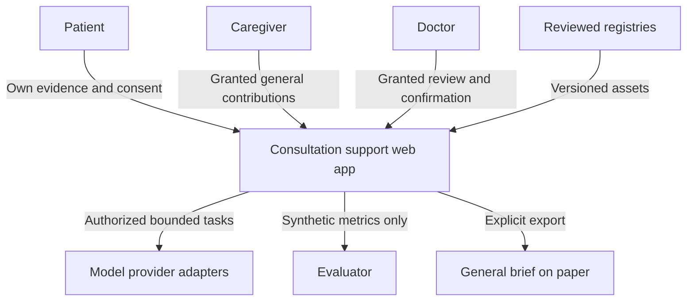
```mermaid
flowchart TB
  P[Patient] -->|Own evidence and consent| APP[Consultation support web app]
  C[Caregiver] -->|Granted general contributions| APP
  D[Doctor] -->|Granted review and confirmation| APP
  APP -->|Authorized bounded tasks| AI[Model provider adapters]
  REG[Reviewed registries] -->|Versioned assets| APP
  APP -->|Synthetic metrics only| E[Evaluator]
  APP -->|Explicit export| PAPER[General brief on paper]
```

### 24.2 End to end architecture

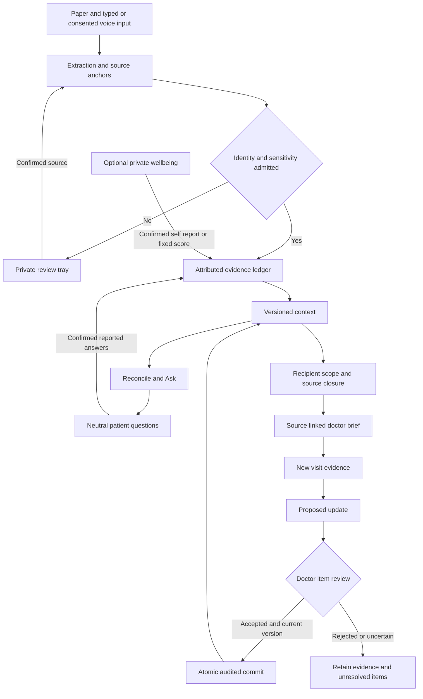
```mermaid
flowchart TB
  CAP[Paper and typed or consented voice input] --> ING[Extraction and source anchors]
  ING --> G{Identity and sensitivity admitted}
  G -->|No| R[Private review tray]
  R -->|Confirmed source| ING
  G -->|Yes| LED[Attributed evidence ledger]
  LED --> CTX[Versioned context]
  CTX --> REC[Reconcile and Ask]
  REC --> Q[Neutral patient questions]
  Q -->|Confirmed reported answers| LED
  WB[Optional private wellbeing] -->|Confirmed self report or fixed score| LED
  CTX --> POL[Recipient scope and source closure]
  POL --> BR[Source linked doctor brief]
  BR --> V[New visit evidence]
  V --> UP[Proposed update]
  UP --> HR{Doctor item review}
  HR -->|Accepted and current version| TX[Atomic audited commit]
  HR -->|Rejected or uncertain| HOLD[Retain evidence and unresolved items]
  TX --> CTX
```

### 24.3 Component ownership

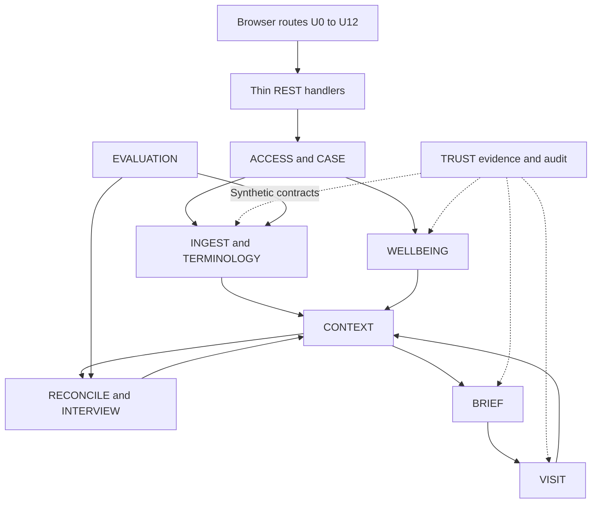
```mermaid
flowchart TB
  UI[Browser routes U0 to U12] --> API[Thin REST handlers]
  API --> ACCESS[ACCESS and CASE]
  ACCESS --> INGEST[INGEST and TERMINOLOGY]
  ACCESS --> WB[WELLBEING]
  INGEST --> CTX[CONTEXT]
  WB --> CTX
  CTX --> REC[RECONCILE and INTERVIEW]
  REC --> CTX
  CTX --> BRIEF[BRIEF]
  BRIEF --> VISIT[VISIT]
  VISIT --> CTX
  TRUST[TRUST evidence and audit] -.-> INGEST
  TRUST -.-> WB
  TRUST -.-> BRIEF
  TRUST -.-> VISIT
  EVAL[EVALUATION] -->|Synthetic contracts| INGEST
  EVAL --> REC
```

### 24.4 Data flow and trust boundaries

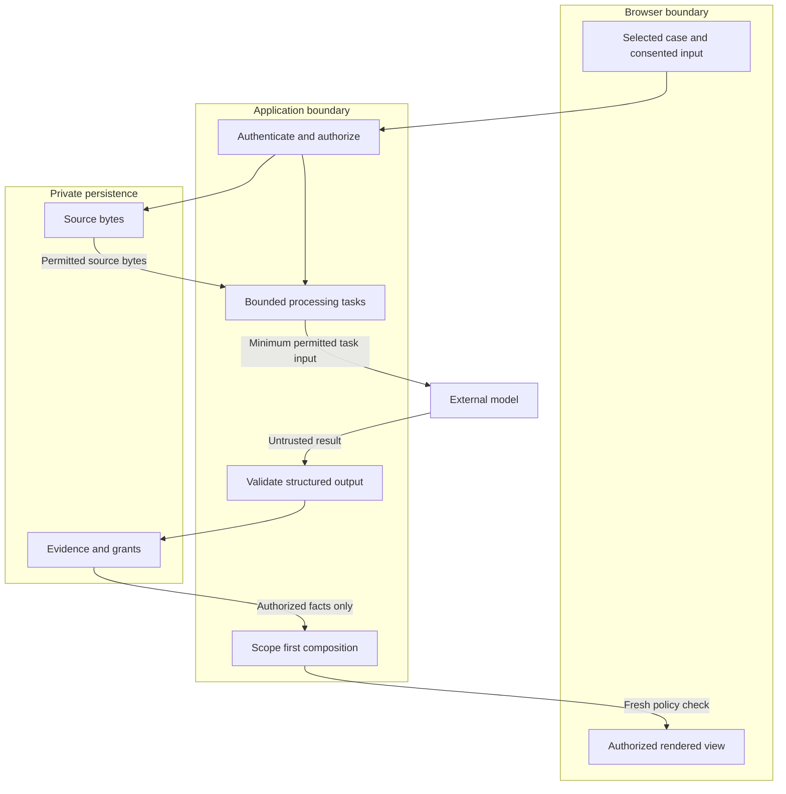
```mermaid
flowchart TB
  subgraph Client[Browser boundary]
    INPUT[Selected case and consented input]
    VIEW[Authorized rendered view]
  end
  subgraph Server[Application boundary]
    AUTH[Authenticate and authorize]
    PROC[Bounded processing tasks]
    VALID[Validate structured output]
    COMPOSE[Scope first composition]
  end
  subgraph Persistence[Private persistence]
    OBJ[Source bytes]
    DB[Evidence and grants]
  end
  INPUT --> AUTH
  AUTH --> OBJ
  AUTH --> PROC
  OBJ -->|Permitted source bytes| PROC
  PROC -->|Minimum permitted task input| MODEL[External model]
  MODEL -->|Untrusted result| VALID
  VALID --> DB
  DB -->|Authorized facts only| COMPOSE
  COMPOSE -->|Fresh policy check| VIEW
```

### 24.5 Document processing pipeline

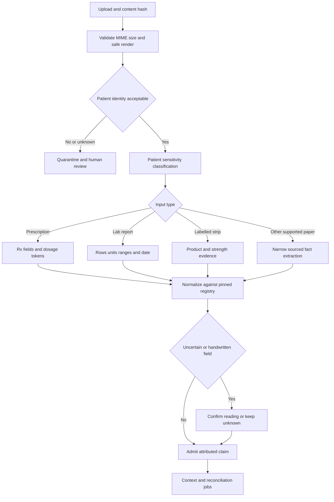
```mermaid
flowchart TB
  U[Upload and content hash] --> SAFE[Validate MIME size and safe render]
  SAFE --> ID{Patient identity acceptable}
  ID -->|No or unknown| QUAR[Quarantine and human review]
  ID -->|Yes| SENS[Patient sensitivity classification]
  SENS --> TYPE{Input type}
  TYPE -->|Prescription| RX[Rx fields and dosage tokens]
  TYPE -->|Lab report| LAB[Rows units ranges and date]
  TYPE -->|Labelled strip| STRIP[Product and strength evidence]
  TYPE -->|Other supported paper| OTHER[Narrow sourced fact extraction]
  RX --> NORM[Normalize against pinned registry]
  LAB --> NORM
  STRIP --> NORM
  OTHER --> NORM
  NORM --> REVIEW{Uncertain or handwritten field}
  REVIEW -->|Yes| HUMAN[Confirm reading or keep unknown]
  REVIEW -->|No| ADMIT[Admit attributed claim]
  HUMAN --> ADMIT
  ADMIT --> EVT[Context and reconciliation jobs]
```

### 24.6 Reconcile and Ask pipeline

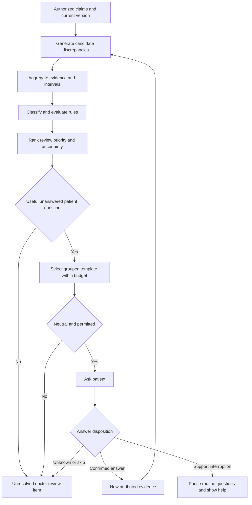
```mermaid
flowchart TB
  SCOPE[Authorized claims and current version] --> CAND[Generate candidate discrepancies]
  CAND --> EV[Aggregate evidence and intervals]
  EV --> RULE[Classify and evaluate rules]
  RULE --> RANK[Rank review priority and uncertainty]
  RANK --> NEED{Useful unanswered patient question}
  NEED -->|No| DOC[Unresolved doctor review item]
  NEED -->|Yes| PLAN[Select grouped template within budget]
  PLAN --> SAFE{Neutral and permitted}
  SAFE -->|No| DOC
  SAFE -->|Yes| ASK[Ask patient]
  ASK --> ANSWER{Answer disposition}
  ANSWER -->|Confirmed answer| CLAIM[New attributed evidence]
  ANSWER -->|Unknown or skip| DOC
  ANSWER -->|Support interruption| HELP[Pause routine questions and show help]
  CLAIM --> CAND
```

### 24.7 One minute brief pipeline

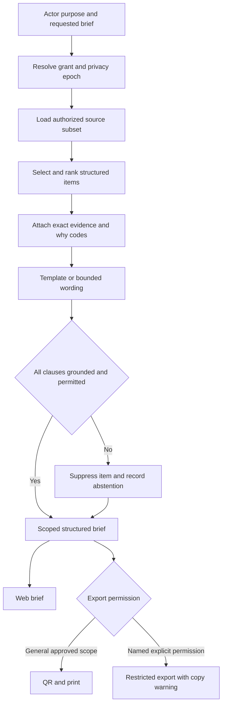
```mermaid
flowchart TB
  REQ[Actor purpose and requested brief] --> POL[Resolve grant and privacy epoch]
  POL --> FILTER[Load authorized source subset]
  FILTER --> RANK[Select and rank structured items]
  RANK --> CITE[Attach exact evidence and why codes]
  CITE --> TEXT[Template or bounded wording]
  TEXT --> CHECK{All clauses grounded and permitted}
  CHECK -->|No| ABS[Suppress item and record abstention]
  CHECK -->|Yes| SNAP[Scoped structured brief]
  SNAP --> WEB[Web brief]
  SNAP --> EXP{Export permission}
  EXP -->|General approved scope| QR[QR and print]
  EXP -->|Named explicit permission| PDF[Restricted export with copy warning]
  ABS --> SNAP
```

### 24.8 Visit update state machine

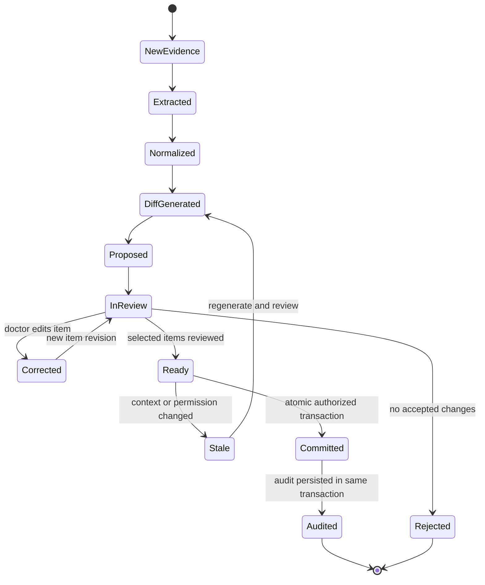
```mermaid
stateDiagram-v2
  [*] --> NewEvidence
  NewEvidence --> Extracted
  Extracted --> Normalized
  Normalized --> DiffGenerated
  DiffGenerated --> Proposed
  Proposed --> InReview
  InReview --> Corrected: doctor edits item
  Corrected --> InReview: new item revision
  InReview --> Rejected: no accepted changes
  InReview --> Ready: selected items reviewed
  Ready --> Stale: context or permission changed
  Stale --> DiffGenerated: regenerate and review
  Ready --> Committed: atomic authorized transaction
  Committed --> Audited: audit persisted in same transaction
  Audited --> [*]
  Rejected --> [*]
```

The separate Audited label describes the observable commit receipt. Audit insertion is inside the commit transaction; the diagram does not permit a durable committed clinical change without its required audit.

### 24.9 Trust and provenance flow

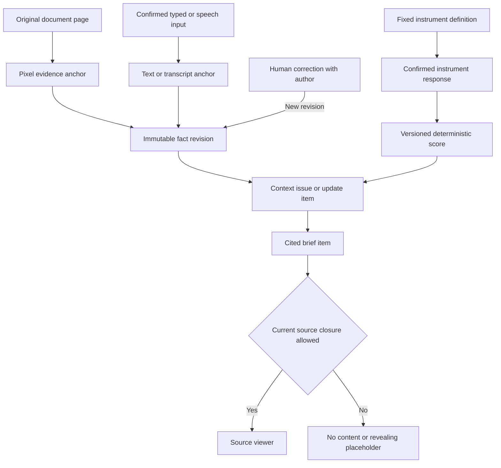
```mermaid
flowchart TB
  PAGE[Original document page] --> ANCHOR[Pixel evidence anchor]
  INPUT[Confirmed typed or speech input] --> SPAN[Text or transcript anchor]
  ITEM[Fixed instrument definition] --> RESPONSE[Confirmed instrument response]
  ANCHOR --> FACT[Immutable fact revision]
  SPAN --> FACT
  RESPONSE --> SCORE[Versioned deterministic score]
  FACT --> DER[Context issue or update item]
  SCORE --> DER
  DER --> BRIEF[Cited brief item]
  BRIEF --> ACCESS{Current source closure allowed}
  ACCESS -->|Yes| JUMP[Source viewer]
  ACCESS -->|No| DENY[No content or revealing placeholder]
  REVIEW[Human correction with author] -->|New revision| FACT
```

### 24.10 Entity relationship diagrams

#### 24.10.1 Evidence and clinical context

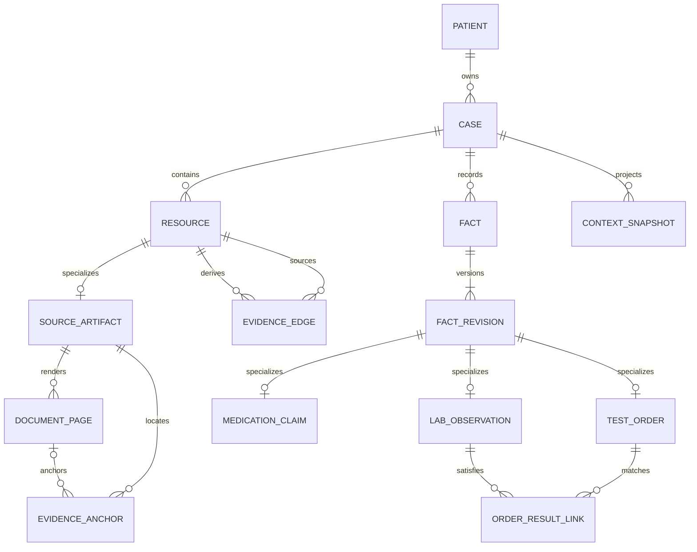
```mermaid
erDiagram
  direction TB
  PATIENT ||--o{ CASE : owns
  CASE ||--o{ RESOURCE : contains
  RESOURCE ||--o| SOURCE_ARTIFACT : specializes
  SOURCE_ARTIFACT ||--o{ DOCUMENT_PAGE : renders
  SOURCE_ARTIFACT ||--o{ EVIDENCE_ANCHOR : locates
  DOCUMENT_PAGE o|--o{ EVIDENCE_ANCHOR : anchors
  RESOURCE ||--o{ EVIDENCE_EDGE : derives
  RESOURCE ||--o{ EVIDENCE_EDGE : sources
  CASE ||--o{ FACT : records
  FACT ||--|{ FACT_REVISION : versions
  FACT_REVISION ||--o| MEDICATION_CLAIM : specializes
  FACT_REVISION ||--o| LAB_OBSERVATION : specializes
  FACT_REVISION ||--o| TEST_ORDER : specializes
  TEST_ORDER ||--o{ ORDER_RESULT_LINK : matches
  LAB_OBSERVATION ||--o{ ORDER_RESULT_LINK : satisfies
  CASE ||--o{ CONTEXT_SNAPSHOT : projects
```

#### 24.10.2 Workflow and review

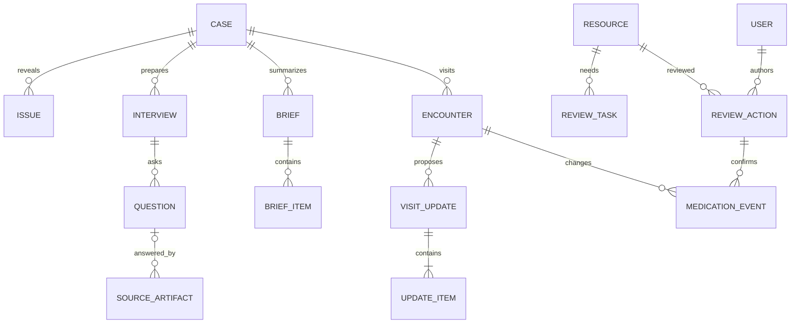
```mermaid
erDiagram
  direction TB
  CASE ||--o{ ISSUE : reveals
  CASE ||--o{ INTERVIEW : prepares
  INTERVIEW ||--o{ QUESTION : asks
  QUESTION o|--o{ SOURCE_ARTIFACT : answered_by
  CASE ||--o{ BRIEF : summarizes
  BRIEF ||--o{ BRIEF_ITEM : contains
  CASE ||--o{ ENCOUNTER : visits
  ENCOUNTER ||--o{ VISIT_UPDATE : proposes
  VISIT_UPDATE ||--|{ UPDATE_ITEM : contains
  RESOURCE ||--o{ REVIEW_TASK : needs
  RESOURCE ||--o{ REVIEW_ACTION : reviewed
  USER ||--o{ REVIEW_ACTION : authors
  REVIEW_ACTION ||--o{ MEDICATION_EVENT : confirms
  ENCOUNTER ||--o{ MEDICATION_EVENT : changes
```

#### 24.10.3 Private wellbeing and authorization

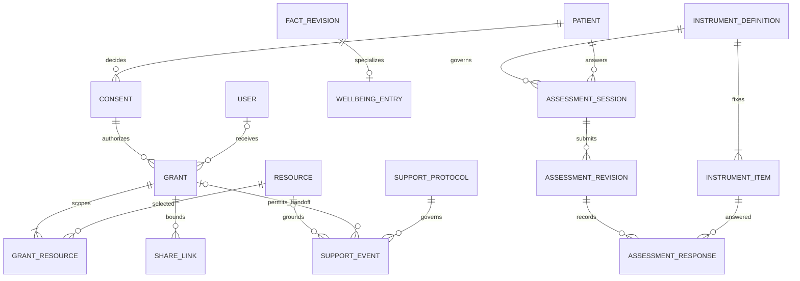
```mermaid
erDiagram
  direction TB
  PATIENT ||--o{ CONSENT : decides
  CONSENT ||--o{ GRANT : authorizes
  USER o|--o{ GRANT : receives
  GRANT ||--|{ GRANT_RESOURCE : scopes
  RESOURCE ||--o{ GRANT_RESOURCE : selected
  GRANT ||--o{ SHARE_LINK : bounds
  FACT_REVISION ||--o| WELLBEING_ENTRY : specializes
  INSTRUMENT_DEFINITION ||--|{ INSTRUMENT_ITEM : fixes
  INSTRUMENT_DEFINITION ||--o{ ASSESSMENT_SESSION : governs
  PATIENT ||--o{ ASSESSMENT_SESSION : answers
  ASSESSMENT_SESSION ||--o{ ASSESSMENT_REVISION : submits
  ASSESSMENT_REVISION ||--o{ ASSESSMENT_RESPONSE : records
  INSTRUMENT_ITEM ||--o{ ASSESSMENT_RESPONSE : answered
  RESOURCE o|--o{ SUPPORT_EVENT : grounds
  GRANT o|--o{ SUPPORT_EVENT : permits_handoff
  SUPPORT_PROTOCOL ||--o{ SUPPORT_EVENT : governs
```

### 24.11 Major user sequence

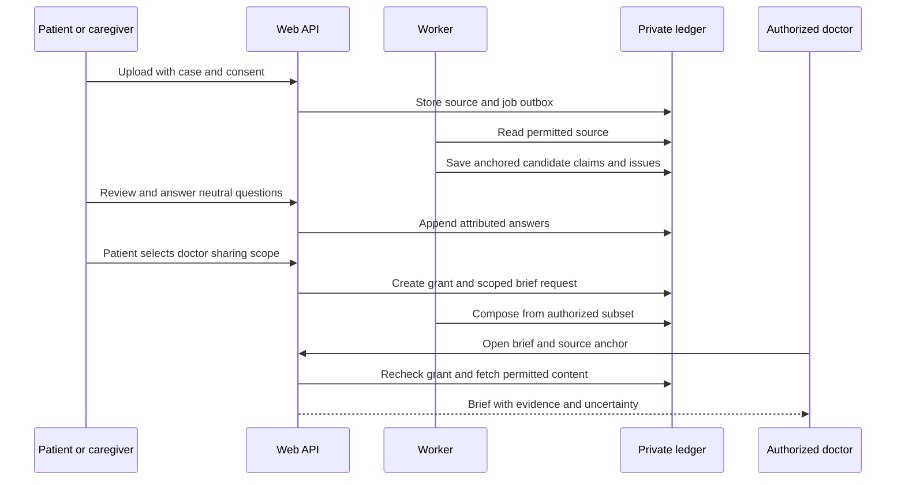
```mermaid
sequenceDiagram
  participant P as Patient or caregiver
  participant A as Web API
  participant W as Worker
  participant DB as Private ledger
  participant D as Authorized doctor
  P->>A: Upload with case and consent
  A->>DB: Store source and job outbox
  W->>DB: Read permitted source
  W->>DB: Save anchored candidate claims and issues
  P->>A: Review and answer neutral questions
  A->>DB: Append attributed answers
  P->>A: Patient selects doctor sharing scope
  A->>DB: Create grant and scoped brief request
  W->>DB: Compose from authorized subset
  D->>A: Open brief and source anchor
  A->>DB: Recheck grant and fetch permitted content
  A-->>D: Brief with evidence and uncertainty
```

### 24.12 Human review and commit sequence

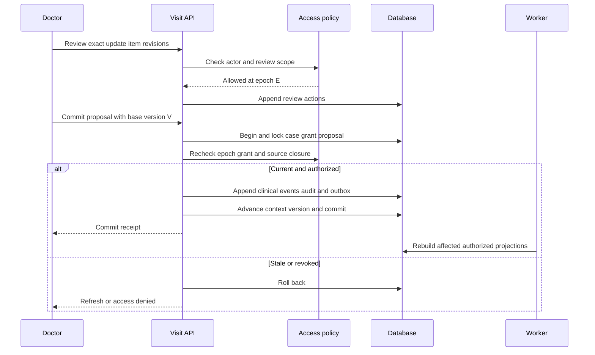
```mermaid
sequenceDiagram
  participant D as Doctor
  participant A as Visit API
  participant P as Access policy
  participant DB as Database
  participant W as Worker
  D->>A: Review exact update item revisions
  A->>P: Check actor and review scope
  P-->>A: Allowed at epoch E
  A->>DB: Append review actions
  D->>A: Commit proposal with base version V
  A->>DB: Begin and lock case grant proposal
  A->>P: Recheck epoch grant and source closure
  alt Current and authorized
    A->>DB: Append clinical events audit and outbox
    A->>DB: Advance context version and commit
    A-->>D: Commit receipt
    W->>DB: Rebuild affected authorized projections
  else Stale or revoked
    A->>DB: Roll back
    A-->>D: Refresh or access denied
  end
```

### 24.13 Deployment architecture

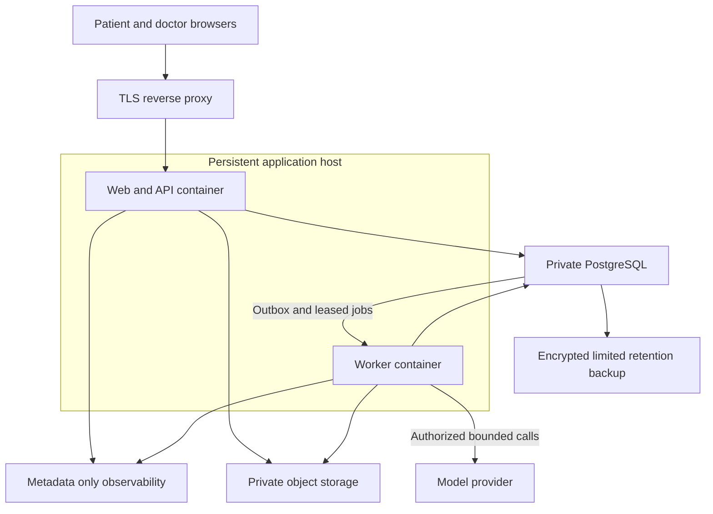
```mermaid
flowchart TB
  B[Patient and doctor browsers] --> TLS[TLS reverse proxy]
  subgraph Host[Persistent application host]
    WEB[Web and API container]
    WORKER[Worker container]
  end
  TLS --> WEB
  WEB --> PG[Private PostgreSQL]
  WORKER --> PG
  PG -->|Outbox and leased jobs| WORKER
  WEB --> OBJ[Private object storage]
  WORKER --> OBJ
  WORKER -->|Authorized bounded calls| MODEL[Model provider]
  WEB --> LOG[Metadata only observability]
  WORKER --> LOG
  PG --> BACKUP[Encrypted limited retention backup]
```

### 24.14 Async job flow

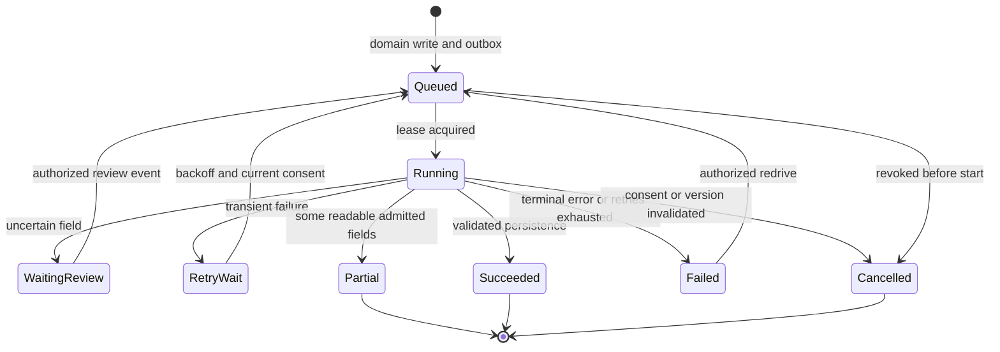
```mermaid
stateDiagram-v2
  [*] --> Queued: domain write and outbox
  Queued --> Running: lease acquired
  Running --> WaitingReview: uncertain field
  WaitingReview --> Queued: authorized review event
  Running --> RetryWait: transient failure
  RetryWait --> Queued: backoff and current consent
  Running --> Partial: some readable admitted fields
  Running --> Succeeded: validated persistence
  Running --> Failed: terminal error or retries exhausted
  Running --> Cancelled: consent or version invalidated
  Queued --> Cancelled: revoked before start
  Failed --> Queued: authorized redrive
  Partial --> [*]
  Succeeded --> [*]
  Cancelled --> [*]
```

### 24.15 Consent and share flow

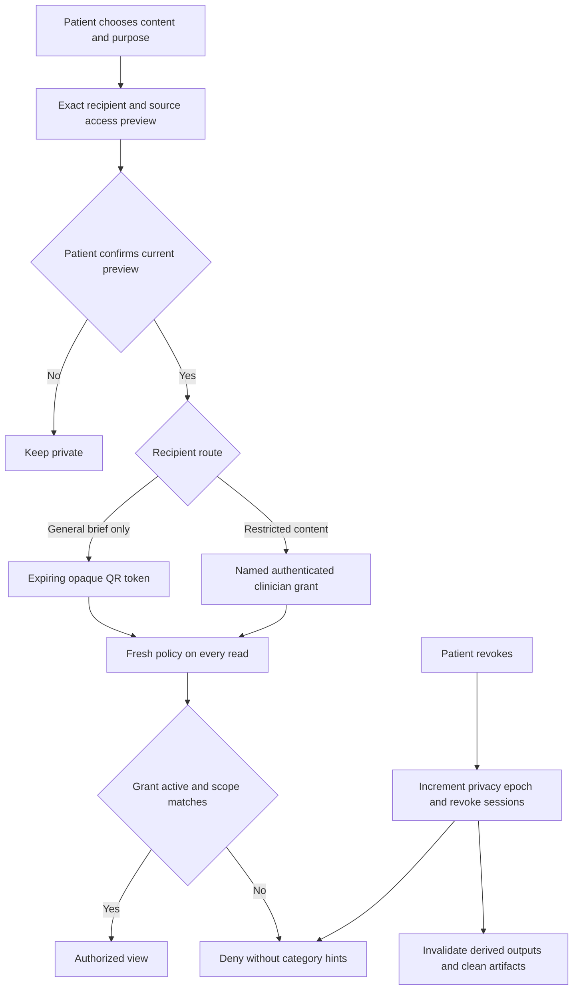
```mermaid
flowchart TB
  SELECT[Patient chooses content and purpose] --> PREVIEW[Exact recipient and source access preview]
  PREVIEW --> CONSENT{Patient confirms current preview}
  CONSENT -->|No| PRIVATE[Keep private]
  CONSENT -->|Yes| TYPE{Recipient route}
  TYPE -->|General brief only| TOKEN[Expiring opaque QR token]
  TYPE -->|Restricted content| NAMED[Named authenticated clinician grant]
  TOKEN --> READ[Fresh policy on every read]
  NAMED --> READ
  READ --> EXP{Grant active and scope matches}
  EXP -->|Yes| VIEW[Authorized view]
  EXP -->|No| DENY[Deny without category hints]
  REVOKE[Patient revokes] --> EPOCH[Increment privacy epoch and revoke sessions]
  EPOCH --> DENY
  EPOCH --> CLEAN[Invalidate derived outputs and clean artifacts]
```

### 24.16 Integrated wellbeing journey

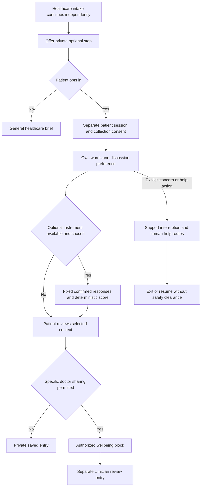
```mermaid
flowchart TB
  MED[Healthcare intake continues independently] --> INVITE[Offer private optional step]
  INVITE --> OPT{Patient opts in}
  OPT -->|No| GENERAL[General healthcare brief]
  OPT -->|Yes| PRIVATE[Separate patient session and collection consent]
  PRIVATE --> OWN[Own words and discussion preference]
  OWN --> ASSESS{Optional instrument available and chosen}
  ASSESS -->|No| REVIEW[Patient reviews selected context]
  ASSESS -->|Yes| FIXED[Fixed confirmed responses and deterministic score]
  FIXED --> REVIEW
  REVIEW --> SHARE{Specific doctor sharing permitted}
  SHARE -->|No| SAVED[Private saved entry]
  SHARE -->|Yes| AUTHBR[Authorized wellbeing block]
  AUTHBR --> CLIN[Separate clinician review entry]
  OWN -->|Explicit concern or help action| HELP[Support interruption and human help routes]
  HELP --> EXIT[Exit or resume without safety clearance]
```

### 24.17 Assessment and scoring state machine

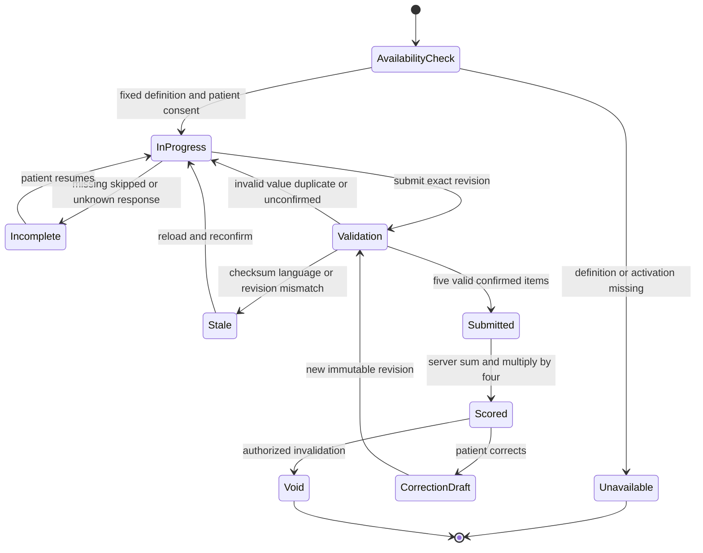
```mermaid
stateDiagram-v2
  [*] --> AvailabilityCheck
  AvailabilityCheck --> Unavailable: definition or activation missing
  AvailabilityCheck --> InProgress: fixed definition and patient consent
  InProgress --> Incomplete: missing skipped or unknown response
  Incomplete --> InProgress: patient resumes
  InProgress --> Validation: submit exact revision
  Validation --> InProgress: invalid value duplicate or unconfirmed
  Validation --> Stale: checksum language or revision mismatch
  Stale --> InProgress: reload and reconfirm
  Validation --> Submitted: five valid confirmed items
  Submitted --> Scored: server sum and multiply by four
  Scored --> CorrectionDraft: patient corrects
  CorrectionDraft --> Validation: new immutable revision
  Scored --> Void: authorized invalidation
  Unavailable --> [*]
  Void --> [*]
```

Scored is completion of arithmetic only. Sharing, acknowledgement, support and clinical interpretation are separate workflows.

### 24.18 Sensitive evidence and derived access

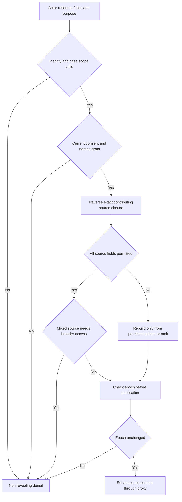
```mermaid
flowchart TB
  REQ[Actor resource fields and purpose] --> SESS{Identity and case scope valid}
  SESS -->|No| DENY[Non revealing denial]
  SESS -->|Yes| GRANT{Current consent and named grant}
  GRANT -->|No| DENY
  GRANT -->|Yes| ROOT[Traverse exact contributing source closure]
  ROOT --> ALL{All source fields permitted}
  ALL -->|No| REBUILD[Rebuild only from permitted subset or omit]
  ALL -->|Yes| MIX{Mixed source needs broader access}
  MIX -->|Yes| DENY
  MIX -->|No| EPOCH[Check epoch before publication]
  EPOCH --> CURRENT{Epoch unchanged}
  CURRENT -->|No| DENY
  CURRENT -->|Yes| VIEW[Serve scoped content through proxy]
  REBUILD --> EPOCH
```

### 24.19 Support handoff and human acknowledgement

```mermaid
sequenceDiagram
  participant P as Patient
  participant UI as Help surface
  participant API as Support API
  participant Q as Recipient queue
  participant D as Named clinician
  P->>UI: Explicit disclosure or Help
  UI-->>P: Reviewed support and human help routes
  Note over UI,API: Display does not wait for backend success
  P->>API: Optional handoff with explicit grant
  alt No monitored recipient
    API-->>P: UNMONITORED no response promise
  else Recipient available and permitted
    API->>API: Create protected event and task
    API->>Q: Deliver authorized request
    Q-->>API: Delivery receipt
    API-->>P: DELIVERED not yet acknowledged
    D->>API: Read permitted task
    API->>API: Record actual SEEN
    D->>API: Explicit acknowledge action
    API-->>P: ACKNOWLEDGED actual actor and time
  end
  Note over P,D: No automatic family alert and no safety clearance
```


## 25 Feature Traceability Matrix and Dependency Reconciliation

Exactly one row per required feature appears below: 18 CORE, 27 ORIGINAL MVP and 5 ADDED MVP. Frontend IDs refer to Section 6; module names to Section 7; journeys to Section 3. Entity aliases resolve to Section12. Inputs and outputs describe the actual implementation boundary rather than a marketing feature label.

Prototype status describes the intended build/demo execution, not work already completed. Assessment runtime is UNAVAILABLE until activation, then DEMO_ONLY with a genuinely executing scorer. All clinical/rights gates remain separate from feature inclusion.

### 25.1 CORE features

| Feature ID | Feature name | Capability | Frontend | Backend module | AI or rule component | Inputs | Outputs | Persisted entities | Human review | Trust and safety control | Prototype status | Dependencies | Journey |
| --- | --- | --- | --- | --- | --- | --- | --- | --- | --- | --- | --- | --- | --- |
| F002 | Structured Prescription Extraction | Paper to Evidence | U2 | INGEST | Document VLM and dosage parser | Rx page and source metadata | Structured proposed drugs tests instructions and anchors | SourceArtifact; EvidenceAnchor; FactRevision; MedicationClaim; TestOrder | Confirm uncertain fields; doctor for clinical adoption | Keep raw notation; no inferred dose; source every field | LIVE constrained printed fixtures | F003 F062; TRUST | J1 J4 |
| F007 | Diagnostic Centre Report Parser | Paper to Evidence | U2 U3 | INGEST | Layout VLM plus row validator | Report page with rows and date | Raw test value unit range and lab identity | SourceArtifact; LabObservation; EvidenceAnchor | Review ambiguous columns or dates | No guessed units; unsupported formats explicit | LIVE constrained centre layouts | F091; file validation | J1 |
| F015 | Medical Terminology and Entity Resolution | Paper to Evidence | U2 U3 | TERMINOLOGY | Curated aliases and exact or fuzzy candidates | Raw brands tests abbreviations dates | Versioned normalized concepts or UNKNOWN | Concept; FactRevision; ProcessingRun | Human selects ambiguous match | Original text retained; no condition inference | LIVE constrained dictionary | F062 F091 | J1 J4 |
| F026 | Evidence Request Queue | Reconcile and Ask | U4 | RECONCILE | Issue to evidence request rules | Unresolved issue and missing evidence type | Neutral photo date or result request | Issue; Question | Patient responds or skips | Request only useful permitted evidence | LIVE | F064 F103 | J1 |
| F062 | Bangladesh Brand to Generic Normalization | Paper to Evidence | U2 U3 | TERMINOLOGY | Versioned product registry lookup | Legible brand strength and form | Ingredient product strength class candidates | DrugProduct; MedicationClaim; FactRevision | Unknown or fuzzy match reviewed | Exact ingredient and class overlap kept separate | LIVE curated 100 product target | F015; G01 | J1 J4 |
| F063 | Duplicate Therapy Detection | Reconcile and Ask | U3 U7 | RECONCILE | RX01 and RX02 with interval checks | Prescribed and reported medication claims | Doctor review candidate and neutral question target | Issue; EvidenceEdge | Doctor decides significance and resolution | No patient stop switch or dose instruction | LIVE | F062 F066 | J1 J3 |
| F064 | Medicine Strip Photo Reconciliation | Reconcile and Ask | U2 U3 U4 | INGEST and RECONCILE | Packaging OCR then RX03 | Labelled strip image and Rx claims | Seen at home claim and mismatch candidate | SourceArtifact; MedicationClaim; Issue | Confirm unclear packaging text and actual reported use | Possession is not adherence; no loose pill ID | LIVE constrained labelled strips | F062 F071 | J1 |
| F066 | Medication State Engine | Evidence to Context | U3 U9 | CONTEXT | Separate claim projections and reviewed events | Prescription strip reported use and confirmed plan events | Parallel candidate and confirmed state over time | MedicationClaim; MedicationEvent; ContextSnapshot | Doctor for confirmed clinical lifecycle | Omission never auto stops; history preserved | LIVE | F020 F062 F071 | J1 J4 |
| F071 | Multi Source Medication Reconciliation | Evidence to Context | U3 | CONTEXT | Claim grouping and source comparison | All admitted authorized medicine evidence | Prescribed possessed reported and confirmed view | MedicationClaim; ContextSnapshot; EvidenceEdge | Doctor confirms clinically resolved list | Conflicts coexist; no single unqualified current list | LIVE | F062 F066 | J1 J3 |
| F091 | Cross Lab Normalization | Paper to Evidence | U2 U3 | TERMINOLOGY | Test registry and exact unit rules | Raw test value unit range specimen | Normalized value with untouched original and conversion version | LabDefinition; LabObservation; ProcessingRun | Review unknown unit method or mapping | No conversion by guessed unit; no patient interpretation | LIVE 15 to20 tests | F007 F015 | J1 |
| F103 | Adaptive Pre Visit Interview | Reconcile and Ask | U4 | INTERVIEW | Greedy coverage planner and reviewed templates | Permitted unresolved issues complaint and prior answers | Ordered bounded questions and attributed answers | Interview; Question; SourceArtifact; FactRevision | Respondent confirms own answer | Neutral only; skip unknown and stop; instrument items excluded | LIVE text path | F011 F188 F223; F183 for support | J1 J5 |
| F116 | Complaint Conditioned Relevance Brief | One Minute Brief | U7 | BRIEF | Structured relevance ordering and optional bounded wording | Authorized context and complaint | Concise ranked cited brief items | Brief; BriefItem; EvidenceEdge | Doctor interprets; patient controls disclosure | Scope before ranking; unsupported clauses suppressed | LIVE | F015 F201 | J3 |
| F118 | Glanceable Summary Card | One Minute Brief | U7 U8 | BRIEF | Fixed structured renderer | Validated ranked brief | Complaint banner issues medications labs and optional wellbeing | Brief; BriefItem | Doctor source inspection available | Uncertainty and dates visible; more context remains accessible | LIVE | F116 F119 | J3 |
| F136 | Encounter Delta and Chart Update Preview | Visit to Update | U9 | VISIT | Deterministic diff of explicit new claims | New prescription or reviewed clip and base context | Before after update proposal with per item evidence | VisitUpdate; UpdateItem; ReviewTask | Doctor accepts corrects or rejects then commits | No silent overwrite; stale version and permission checks | LIVE | F130 optional; F198 | J4 |
| F190 | Contradiction Severity Ranking | Reconcile and Ask | U3 U4 U7 | RECONCILE | Versioned review priority table | Typed issues and relevant evidence uncertainty | Review first next or information order and reasons | Issue; ProcessingRun | Clinical reviewer approves rule table; doctor judges issue | Priority is not patient risk or triage; full list retained | LIVE constrained rules | F015; RX and LAB rule catalog | J1 J3 |
| F197 | Span Level Evidence Jump | Trust | U2 U3 U7 U9 | TRUST and ACCESS | Evidence DAG and validated source coordinates | Clinical item and current actor | Exact authorized crop page text or response source | EvidenceAnchor; EvidenceEdge; Resource | Review invalid anchors | Source proxy rechecks all permissions; mixed source denied | LIVE | F002 F007; ACCESS | J1 J3 J4 |
| F198 | Provenance and Epistemic Status Labels | Trust | U2 U3 U4 U5 U7 U9 | TRUST | Independent origin processing review validity fields | Any source claim or derived item | Document patient caregiver clinician and uncertainty labels | FactRevision; ReviewAction; EvidenceEdge | Only authorized actor upgrades relevant review dimension | No source kind erased by confirmation | LIVE | Resource and evidence ledger | J1 J2 J3 J4 |
| F200 | Abstention and Unsourced Claim Guard | Trust | U2 U3 U4 U5 U7 U9 | TRUST | Schema grounding and review gates | Uncertain or unsupported candidate | UNKNOWN NEEDS_REVIEW or suppression with blind spot | FactRevision; Issue; ProcessingRun | Human may supply evidence or confirm reading | No invented missing facts or reassuring negative | LIVE | F197 F199 | J1 J2 J3 J4 |

### 25.2 ORIGINAL MVP features

| Feature ID | Feature name | Capability | Frontend | Backend module | AI or rule component | Inputs | Outputs | Persisted entities | Human review | Trust and safety control | Prototype status | Dependencies | Journey |
| --- | --- | --- | --- | --- | --- | --- | --- | --- | --- | --- | --- | --- | --- |
| F003 | Narrow Handwritten Prescription Recognition | Paper to Evidence | U2 | INGEST | VLM candidate readings for narrow set | Handwritten prescription crop | Candidate text alternatives or unreadable | ProcessingRun; EvidenceAnchor; FactRevision | Always confirm handwritten drug reading | No auto acceptance of handwritten drug identity | PREPROCESSED BUT REAL allowed; review LIVE | F062 F200; limited candidate UI | J1 |
| F011 | Patient Narrative to Structured History | Paper to Evidence | U4 U5 | INGEST and INTERVIEW | Optional bounded text structuring | Typed or confirmed spoken own words | Complaint onset duration and agenda candidates | SourceArtifact; FactRevision | Actual respondent confirms wording | Original preserved; no symptom explanation or diagnosis | LIVE text; speech may be preprocessed | F223 F224 | J1 J2 |
| F017 | Wrong Patient and Record Mix Up Check | Paper to Evidence | U2 | INGEST | Name variants and explicit identity comparison | Case profile and document identity fields | Quarantine or reviewable admission decision | SourceArtifact; ReviewTask; ReviewAction | Patient or permitted doctor resolves identity | No facts from uncertain subject; no clinical plausibility reassignment | LIVE constrained identity checks | F015; explicit case selection | J1 |
| F020 | Supersession Detection | Paper to Evidence | U2 U3 U9 | CONTEXT | Explicit change wording and temporal proposals | Dated old and new prescriptions | Proposed supersession relation | FactRevision; EvidenceEdge; UpdateItem | Doctor confirms clinical change | Newer date alone cannot stop or replace a medicine | LIVE | F066; exact duplicate hygiene | J1 J4 |
| F025 | Coverage and Blind Spot Map | Trust | U2 U3 U7 | TRUST | Authorized processing and evidence gap projection | Failed fields missing dates and unavailable results | Visible limitations of the permitted context | Issue; ProcessingRun; BriefItem | Doctor sees uncertainty; contributor can add source | No hidden sensitive count or completeness score | LIVE | Pipeline stage outcomes; F200 | J1 J3 |
| F068 | Per Visit Medication Change Ledger | Visit to Update | U9 U3 | VISIT and CONTEXT | Reviewed before after event projection | Prior plan and accepted visit changes | Previous changes and new confirmed plan | MedicationEvent; VisitUpdate; ContextSnapshot | Doctor confirmation required | Patient reported use stays separate from new plan | LIVE | F066 F136 | J4 |
| F070 | Stop Reason Elicitation | Reconcile and Ask | U4 U3 | INTERVIEW | Neutral stop reason template | Explicit reported stop or uncertain continuation | Attributed reason or reason unknown | SourceArtifact; FactRevision; Question | Patient confirms experience; doctor interprets | No inferred nonadherence or blame | LIVE | F066; narrowed F072 dependency | J1 |
| F075 | Off Record Medicine Capture | Reconcile and Ask | U4 U2 U3 | INTERVIEW and CONTEXT | Typed or strip capture with attribution | Pharmacy herbal informal provider self report | Labelled off record medication claim | SourceArtifact; MedicationClaim; Issue | Patient or caregiver confirms own report | No provider accusation or herbal interaction advice | LIVE | F064 F198 | J1 |
| F081 | Allergy and Adverse Reaction Registry | Evidence to Context | U3 U7 | CONTEXT | Sourced reaction extraction and status projection | Explicit document or reported reaction | Attributed reaction list with verification tier | FactRevision allergy kind; EvidenceEdge | Doctor verifies clinical status | Rash mention not automatically confirmed allergy; no cross reactivity checker | LIVE | F198 | J1 J3 |
| F093 | Longitudinal Lab Trend Charts | Evidence to Context | U3 U7 | CONTEXT and BRIEF | Deterministic comparable points and source links | Authorized dated normalized observations | Lab chart with per point range and source | LabObservation; BriefItem | Doctor interprets; uncertain comparability visible | No universal range or causal clinical caption | LIVE | F091; minimum comparability guard | J3 |
| F099 | Pending and Lost Result Tracker | Evidence to Context | U3 U4 U7 | CONTEXT and RECONCILE | Order result identity and date matching | Sourced advised test and later evidence | Matched result or result not available gap | TestOrder; OrderResultLink; Issue | Patient can report status; doctor reviews match | Not uploaded never means not done; old result cannot satisfy new order | LIVE | F091; limited order extraction | J1 J3 J4 |
| F105 | Patient Agenda and Concern Card | One Minute Brief | U4 U5 U7 | INTERVIEW and BRIEF | Patient selected concerns and bounded structuring | Patient words and discussion preference | Concise authorized agenda at brief top | FactRevision agenda kind; BriefItem | Patient confirms selected concerns | Private concern only under grant; no inferred urgency | LIVE | F011; narrowed F134 F135 dependencies | J1 J2 J3 |
| F119 | Critical Context Banner | One Minute Brief | U7 | BRIEF | High precision sourced fact selection | Authorized allergy reaction and other explicit critical context | Always visible sourced doctor banner | BriefItem; FactRevision | Doctor determines clinical meaning | Keep origin and last review date; no interaction or acute risk inference | LIVE | F081; source timestamps | J3 |
| F130 | Replayed Record Check | Visit to Update | U9 | INGEST and RECONCILE | Batch ASR claim matching to evidence | Consented short synthetic clip and context | Sourced mismatch candidates for review | SourceArtifact; ProcessingRun; Issue; UpdateItem | Actual transcript confirmation and doctor clinical adoption | No suggested next step; no live scribe claim | PREPROCESSED BUT REAL | F066 F190 F223 | J4 |
| F158 | Printable One Pager and QR | One Minute Brief | U8 U7 | BRIEF | Structured HTML print and PDF worker | Explicitly exportable authorized brief | General one pager and opaque QR | Brief; SourceArtifact export; ShareLink | Patient approves export scope | Default excludes wellbeing; copies cannot be recalled | LIVE | F118 F212 | J3 |
| F173 | Provenance Labelled Caregiver Contributions | Evidence to Context | U2 U4 U3 | CASE and INGEST | Contributor attribution | Granted caregiver observation or upload | Separate caregiver reported claim | CaregiverRelationship; SourceArtifact; FactRevision | Caregiver confirms own observation only | Cannot edit verified truth or impersonate self report | LIVE | F198; limited contribution grant | J1 |
| F188 | Red Flag Guardrail at Intake | Reconcile and Ask | U4 U12 | INTERVIEW and WELLBEING | Reviewed explicit language support rules | Typed or confirmed intake with red flag wording | Paused routine intake and human help route | SupportEvent; SupportProtocol | Clinical protocol review before real use | No autonomous triage level diagnosis dispatch or false reassurance | LIVE synthetic reviewed scenario mode | F103 F224 | J1 J5 |
| F199 | Stage Specific Confidence Display | Trust | U2 U3 U7 U9 | TRUST | Distinct OCR ASR mapping and review signals | Provider score or declared missing confidence | Labelled stage quality and review reasons | FactRevision; ProcessingRun | Human confirms uncertain high value fields | No average truth probability; no fabricated vendor score | LIVE | F198 | J1 J3 J4 |
| F201 | Why Shown Relevance Rationale | One Minute Brief | U7 | BRIEF | Rule and ranking reason codes | Selected item and actual selection rule | Short source grounded inclusion reason | BriefItem why_code | Doctor can inspect selection basis | No post hoc diagnostic reasoning or hidden sensitive cause | LIVE | F116 | J3 |
| F204 | Doctor Corrections and Feedback | Visit to Update | U2 U9 U10 | VISIT and TRUST | Versioned accept correct reject commands | Exact proposed fact or update revision | Authored correction and new revision | ReviewAction; FactRevision; UpdateItem | Granted doctor | Original retained; no automatic training or silent score rewrite | LIVE | F198 | J3 J4 |
| F207 | Action and Override Audit Trail | Trust | U10 | TRUST | Transactional audit and scoped access events | Clinical writes grant actions and source reads | Minimal attributed action history | AuditEvent; ReviewAction | Human identity attached to actual actions | No distress text in operational logs; required writes block on audit failure | LIVE | All mutating modules | J1 J2 J3 J4 J5 |
| F210 | Accuracy Scoreboard | Trust | U11 | EVALUATION | Frozen ground truth comparators | Actual synthetic runs and labelled fields | Metrics with denominators slices and failed cases | EvaluationSet; EvaluationCase; EvaluationRun; EvaluationMetric | Evaluator labels and adjudicates | No fabricated percentages or clinical efficacy claims | PREPROCESSED BUT REAL metrics; dashboard LIVE | F204; frozen fixtures | J3 |
| F212 | Time Limited Access Links | One Minute Brief | U6 U8 | ACCESS | Opaque token session expiry and revocation | Patient approved general brief scope | Expiring QR share and revocable session | Grant; GrantResource; ShareLink | Patient approves scope and expiry | Generic bearer never grants sensitive access; fresh checks | LIVE security mechanism | Limited F211 mechanics; F207 | J3 |
| F216 | Ephemeral Consultation Audio | Visit to Update | U4 U9 U6 | INGEST and STORAGE | Consent bound TTL and deletion jobs | Temporary audio and transcript confirmation | Read denial deletion receipt and retained permitted transcript | SourceArtifact; Job; AuditEvent | Recording participants consent; respondent confirms transcript | Maximum 24 hour raw retention; deletion pending shown honestly | LIVE deletion behavior | F217; storage adapter | J1 J4 |
| F217 | Consent Explainer and Understanding Check | Visit to Update | U1 U5 U6 U9 | ACCESS | Reviewed Bangla text audio and fixed understanding prompt | Purpose recipient recording and retention choices | Versioned explicit consent decisions | Consent; Grant | Patient and relevant recording participants | No bundled wellbeing consent; refusal leaves healthcare available | LIVE | Limited F234 playback; F207 | J1 J2 J3 J4 |
| F223 | Bangla English Code Switched Speech | Paper to Evidence | U4 U9 | INGEST | Independent batch speech adapter | Consented Bangla Banglish short clip | Transcript with uncertainty and actual source | SourceArtifact; EvidenceAnchor; ProcessingRun | Respondent confirms; doctor adopts clinical changes | No emotion or speaker identity inference; typed fallback | PREPROCESSED BUT REAL allowed | F015 F224 F216 F217 | J1 J4 |
| F224 | Bangla Lay Symptom Idiom Disambiguation | Paper to Evidence | U4 | TERMINOLOGY and INTERVIEW | Curated40 term lexicon and neutral clarifiers | Own words such as gas or matha ghore | Candidate concept or clarification with original phrase | Concept; FactRevision; Question | Patient clarifies actual meaning | No chest discomfort to gas shortcut; no disease interpretation | LIVE constrained lexicon | F103 | J1 |

### 25.3 ADDED MVP features

| Feature ID | Feature name | Capability | Frontend | Backend module | AI or rule component | Inputs | Outputs | Persisted entities | Human review | Trust and safety control | Prototype status | Dependencies | Journey |
| --- | --- | --- | --- | --- | --- | --- | --- | --- | --- | --- | --- | --- | --- |
| F183 | Bounded Distress and Self Harm Support | Integrated Wellbeing | U4 U5 U12 | WELLBEING | Versioned explicit disclosure rules and support states | Help request typed disclosure or confirmed speech | Support surface and optional permitted human review task | SupportEvent; SupportProtocol; SupportResource; ReviewAction | Clinical protocol before real use; named clinician acknowledgement is actual action | No risk score psychotherapy auto alerts or monitoring claim | LIVE synthetic support; external delivery may be THIN STUB | F103 F213 F217; F207 | J2 J5 |
| F184 | Fixed WHO 5 Assessment Adapter | Integrated Wellbeing | U5 U7 | WELLBEING | Versioned fixed content and integer scorer | Five unique confirmed 0 to5 responses | Raw 0 to25 and transformed 0 to100 score if complete | InstrumentDefinition; AssessmentSession; AssessmentRevision; AssessmentResponse | Patient submits; content rights scorer and clinical activation review separate | No diagnosis imputation threshold escalation or paraphrased instrument | UNAVAILABLE until G02 then DEMO_ONLY with LIVE scorer | F183 F213; G02 | J2 J3 |
| F185 | Bounded Wellbeing History Context | Integrated Wellbeing | U5 U3 U7 | WELLBEING and CONTEXT | Optional own words structuring and sourced history projection | Voluntary concern onset and discussion request | Patient confirmed private timeline and chosen brief context | WellbeingEntry; FactRevision; SourceArtifact; BriefItem | Patient confirms experience; doctor annotation separate | Assessment optional; no medication implied disorder or stress causation | LIVE bounded self report | F213; F184 optional rather than prerequisite | J2 J3 J4 |
| F187 | Respectful Patient Controlled Presentation | Integrated Wellbeing | U5 U7 | WELLBEING and BRIEF | Curated wording and private topic preferences | Patient selected disclosure and exact concern | Respectful concise presentation or private conversation request | WellbeingEntry; BriefItem; GrantResource | Patient chooses wording and whether to disclose | No trauma classification forced retelling or revealing withheld placeholder | LIVE bounded presentation | F213 F185 | J2 J3 |
| F213 | Wellbeing Sensitive Records Vault | Integrated Wellbeing | U5 U6 U7 source drawers | ACCESS and TRUST | Resource field purpose and derivative policy | Patient classification grant lineage and actor | Enforced private storage processing and named doctor access | Resource; Grant; GrantResource; EvidenceEdge; AuditEvent | Patient selects specific doctor and scope | Caregiver denied; mixed page withheld; revocation covers AI PDFs QR logs caches | LIVE mandatory enforcement | Limited F211 sharing; F207 replaces F214 notifications | J2 J3 J4 J5 |


### 25.4 Dependency reconciliation

| Bank dependency | Required implementation mechanic | Full feature remains outside scope |
|---|---|---|
| F002/F003 reference F004 | Show bounded candidate readings and require review under narrow F003 | Context/diagnosis-prior handwriting-disambiguation product |
| F007 references F005 | File validation, safe page rendering and explicit retake error | Live camera coaching system |
| F025 references F006/F016 | Record failed pages/missing fields and exact case-scoped file hashes | Advanced missing-page reasoning and near-duplicate product |
| F017 references F174 | Explicit case identity and separate sessions | Household dashboard and voice/PIN multi-profile product |
| F020 references F016 | Preserve versions and exact-duplicate hygiene | Full perceptual/near-duplicate merging |
| F070 references F072 | Ask a stop reason only after explicit reported stop or unresolved continuation | Inferred adherence-gap analytics |
| F093 references F092 | Conservative no-join on incompatible/unknown units/methods | Full comparability reasoning engine |
| F099 references F151 | Extract sourced test orders and match later result evidence | Reminders and general follow-up orchestration |
| F105 references F134/F135 | Store patient-selected agenda items | Live unanswered-question tracking or closure bot |
| F119 references F018 | Show source/event/review dates | Automated freshness-scoring product |
| F136 references F130 | New prescription is sufficient; replayed clip is optional input | Mandatory live consultation capture |
| F217 references F234 | Reviewed recorded explanation and fixed understanding check | Whole-app voice navigation |
| F184 references F183/F213 | Support branch and sensitive policy must exist before activation | Additional instruments or autonomous crisis assessment |
| F185 references F184 | Self-report works independently; assessment is optional context | Screening prerequisite or inferred psychiatric history |
| F187 references F213 | Private-topic preference and respectful fixed presentation | Automatic trauma classification |
| F213 and F212 reference F211 | Explicit grants, field/resource scope, purpose and expiry in ACCESS | General-purpose AI-selected sharing product |
| F211/F213 reference F214 | Minimal access audit provided by F207 | Full access-notification product and external alerts |
| Review demo uses discharge excerpt but F009 is optional | Generic evidence extraction of the needed sourced reaction in F081 | Full episode-aware discharge parser |
| Corrections require derived invalidation related to F205 | Rebuild dependent views using explicit resource edges | Automatic learning/adaptation and broad “correct once” product |

Circular bank references such as F015↔F062 and F066↔F071 are conceptual dependencies, not cyclic runtime services. TERMINOLOGY owns shared lookups; CONTEXT owns evidence projections; RECONCILE consumes them. F026/F103 similarly share Issue/Question contracts rather than recursively calling each other.

## 26 Prototype versus Roadmap Boundary

Classes: **A** genuinely functional; **B** constrained synthetic implementation; **C** actual preprocessing allowed; **D** openly simulated external effect; **E** roadmap only. No A/B control can be downgraded to a decorative screen.

| Subsystem | Class and execution | Constraint or extension point |
|---|---|---|
| Printed Rx and lab extraction | A/B LIVE | Curated synthetic formats; failures exposed |
| Narrow handwriting | B/C PREPROCESSED BUT REAL permitted | One narrow demo set and actual human reading confirmation |
| Medication/terminology/labs | A/B LIVE |100-product dictionary,15–20tests,40idioms; no coverage claim beyond registry |
| Claims, reconciliation and questions | A/B LIVE | Fixed rule catalog and bounded question budget; no diagnostic advice |
| Evidence jump and trust labels | A LIVE | Every important clinical item has valid authorized lineage |
| Doctor brief and print | A LIVE | Structured brief first; one-page main brief with overflow view |
| General QR and named grants | A LIVE | Expiry/revocation and source access genuinely enforced |
| Visit review and commit | A LIVE | Atomic version-checked doctor action |
| Banglish speech and clip check | B/C PREPROCESSED BUT REAL permitted | Short batch clips; no ambient live scribe |
| Wellbeing entry and respectful display | A/B LIVE | Voluntary self-report; no inferred condition |
| Fixed assessment scoring | A/B; UNAVAILABLE then DEMO_ONLY | Content/rights activation required; scorer is deterministic |
| Distress display and human-help route | A/B LIVE on labelled scenarios | No claimed monitoring or clinical risk classification |
| External handoff delivery | D THIN STUB allowed | Simulation labelled; actual acknowledgement still requires actor action |
| Evaluation | A/C actual runs | Frozen synthetic metrics may be computed earlier |
| F096, F029, F031, F001, F109 | E FUTURE | Optional review priorities remain unpromoted; F029 would require fresh safety review |
| FHIR/SHR, IVR, specialist referral, full family roles | E FUTURE | Adapter boundary only; no dependency in the prototype |
| PHQ-9/GAD-7 and broader sensitive domains | E FUTURE | New instrument/domain approval; not silently activated |
| F186, diagnosis, prescribing, therapy bots, automatic alerts | Excluded | Not ordinary backlog items; require a different product decision and governance |

This 50-feature prototype is substantial even though many rows are policies or labels. Do not promise completion from a single one-shot coding prompt. Build vertical slices with explicit acceptance gates; keep the original minimal Configuration A only as a separately approved contingency, not an automatic scope reduction.

## 27 Open Questions and Activation Gates Before Implementation

### 27.1 Nonblocking engineering assumptions

The implementation AI can begin with the architecture defaults without asking the owner to redesign the system: synthetic adult data, named seeded clinicians, private PostgreSQL/object storage, two application processes, Bangla/English UI, typed input as the reliable path, optional batch speech, no external alerts and the 120-second proposed demo. Exact package versions and credential setup are implementation prerequisites, not reasons to reopen the product scope.

### 27.2 Activation gates

| Gate | Required evidence and responsible role | While unresolved |
|---|---|---|
| G01 branded medication registry | Developer/clinical reviewer verifies product, ingredient, strength, source and usage rights | Use clearly synthetic product fixtures or UNKNOWN; never assert unverified brand equivalence |
| G02 WHO-5 content and rights | Official language assets, visual Bangla comparison, checksum, attribution/usage review, known-answer scorer pass | F184 remains mapped but UNAVAILABLE; no invented questionnaire or score |
| G03 wellbeing/support deployment | Clinical reviewer approves local language, protocol, resources and intended population | Synthetic scenarios only; no real-patient support service claim |
| G04 clinician identity | Real verification workflow and authorization governance | Seeded demo doctors only |
| G05 real-patient data | Privacy/ethics review, jurisdictional legal advice, retention/region/provider terms, deletion and incident handling | Synthetic-only uploads enforced |
| G06 operational handoff | Named service owner, actual availability, response expectations and acknowledgement path | UNMONITORED or explicitly SIMULATED delivery |
| G07 recording | Versioned patient/doctor participant consent and deletion verification | Recording off; typed/new-prescription path fully works |
| G08 model quality | Actual labelled extraction/speech results, critical-error review and abstention behavior | Narrow supported fixtures; no unmeasured accuracy claim |
| G09 presentation scope | Team confirms permitted presentation length and rehearses | Keep120-second combined and 85-second short cuts labelled as proposals |
| G10 adoption hypothesis | Doctors test whether brief and evidence jump fit their workflow; family capture exercise | Treat value/time-saving statements as hypotheses |

No real-world patient deployment is authorized or ready merely because this architecture is complete. There are no unanswered fundamental architecture choices blocking the synthetic build; there are external clinical, rights and operational approvals that software cannot invent.

## 28 Implementation Handoff Checklist

### 28.1 Ordered build slices

| Slice | Build | Exit condition |
|---|---|---|
| S0 contracts and fixtures | Freeze 50 IDs, source manifest, error enums, synthetic assets, terminology registry and architecture decisions | No conflicting feature list; source hashes and expected claims recorded |
| S1 trust foundation | Auth, case ownership, Resource registry, evidence anchors, policy, consent, grants, audit, private storage | Cross-case/caregiver/wrong-doctor denials work before clinical AI integration |
| S2 paper to claims | Printed extraction, lab rows, narrow handwriting review, strip inputs, attribution | One fact follows paper→anchor→normalized claim with visible uncertainty |
| S3 hero loop | Medication projections, issue rules, evidence requests, three neutral questions and typed answers | A01–A09 relevant cases pass; answers clarify without doctor verification |
| S4 brief and sharing | Authorized structured brief, source jump, general QR and PDF | Source access and derived privacy tests pass, including mixed sources |
| S5 wellbeing | Private entry, patient review, fixed assessment adapter, scorer, named disclosure, support states | Opt-out, score validation, restricted access and support failure scenarios pass |
| S6 visit closure | New Rx diff, item review, atomic commit and audit | Concurrent/stale/replayed commits behave correctly; historical claims preserved |
| S7 optional speech and evaluation | Batch clips, replayed record check, audio deletion and actual benchmark runner | Actual run metadata visible; no fabricated metrics or silent fixture fallback |
| S8 demo rehearsal |120-second/85-second cuts, deterministic reset, recorded backup, outage run | Runtime badges truthful; all mandatory privacy/commit gates pass |

### 28.2 Instructions to the implementation AI

Use this document as the construction contract together with the three supplied source files. Preserve all 50 required feature rows and their prototype limitations. Begin with S0/S1; build one complete vertical slice before adding optional speech. Write migrations and domain contracts before screens that depend on them. Route all content through ACCESS; use one truth ledger and the separate clinician-confirmed projection. Keep model outputs as proposals. Do not introduce a chatbot, diagnosis, prescribing, autonomous agents, extra questionnaires or microservices.

When an activation asset is missing, implement its UNAVAILABLE state and the specified independent fallback; do not manufacture content, validation, credentials or approval. Mark runtime status honestly. Do not send notifications, deploy real-patient services or activate external integrations without the relevant explicit request and completed gates. Update the feature status checklist with actual implementation evidence and failures. Architecture labels such as LIVE describe build requirements, not proof of completion.

### 28.3 Final handoff requirements

- Every feature row links to its implemented module/screen and acceptance evidence; 18 CORE + 27 ORIGINAL MVP + 5 ADDED MVP stays 50.
- All important clinical facts and outputs have authorized evidence lineage, source/value preservation and explicit uncertainty.
- Patient, caregiver, doctor, worker and evaluator roles pass direct-API tests, including source bytes and derived artifacts.
- Wellbeing opt-out, incomplete assessment, same-key retries, wrong recipient, mixed-source privacy and revocation races are exercised.
- Doctor updates are transactional, audited and version checked; no asynchronous job bypasses review.
- Scoring fixtures, support workflow tests and model accuracy results are reported separately with actual denominators.
- Audio deletion, expired shares, provider failures and unmonitored handoffs are visibly truthful.
- A frozen version manifest identifies source fixtures, dictionaries, instruments, protocols, model IDs, prompts and dependencies.
- No performance, legal-compliance or clinical-efficacy claim is inferred from this architecture or synthetic evaluation alone.

### 28.4 Primary references and attribution

References were opened during this architecture review on 30 September 2026. They support the narrow facts noted in the text; the product/engineering design is a proposed implementation of P/R/B, not approval by any referenced organization. No full instrument questionnaire is reproduced here.

| Ref | Primary source | Use |
|---|---|---|
| R1 | [WHO publication and official language downloads](https://www.who.int/publications/m/item/WHO-UCN-MSD-MHE-2024.01) | WHO-5 scope, Bangla availability and stated licence |
| R2 | [WHO English instrument and scoring PDF](https://cdn.who.int/media/docs/default-source/mental-health/who-5_english-original4da539d6ed4b49389e3afe47cda2326a.pdf) | Fixed response scale and arithmetic |
| R2B | [Official Bangla instrument PDF](https://cdn.who.int/media/docs/default-source/mental-health/five-well-being-index-(who-5)/who-5-final-bangla-version.pdf) | Source for implementation-time visual transcription verification |
| R3 | [NIMH adult outpatient BSSA PDF dated 8 December 2025](https://www.nimh.nih.gov/sites/default/files/documents/research/research-conducted-at-nimh/asq-toolkit-materials/adult-outpatient/bssa-outpatient-adult-asq-nimh-toolkit.pdf) | Distinction between software support and trained human assessment; no imported US contacts |
| T1 | [PostgreSQL row security policies](https://www.postgresql.org/docs/current/ddl-rowsecurity.html) | Default-deny policies and owner/BYPASSRLS caveat |
| T2 | [Next.js self-hosting guide](https://nextjs.org/docs/app/guides/self-hosting) | Persistent web deployment and reverse proxy |
| T3 | [pg-boss project documentation](https://github.com/timgit/pg-boss) | PostgreSQL-backed queue and retry/transaction support |
| T4 | [Gemini structured outputs](https://ai.google.dev/gemini-api/docs/structured-output) | Schema-constrained adapter capability; server semantic validation still required |
| T5 | [Gemini audio understanding](https://ai.google.dev/gemini-api/docs/audio) | Candidate batch audio adapter; no accuracy claim |
| T6 | [Better Auth documentation](https://better-auth.com/docs/introduction) | Authentication/session library capability |

